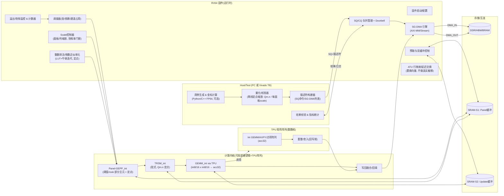

# 1) 软硬件总体架构（整数专用版）+ 数据流图

> 目标：在**纯整数**算力（int8/16 乘，int32 累加）下跑**块化 LU（部分选主元）\**的主干流水：Panel-GEPP → TRSM → GEMM 更新；用\**定点缩放**与**溢出监控**替代浮点/IR；由 **RV64 固件**推进工作队列；Vivado 上可用 testbench 驱动端模拟“主机”。



### 关键模块最小说明（与实现优先级）

- **HOST/Test（可由 Vivado TB 充当）**
  ① 生成矩阵与金标解（可选 FP64，用于对比）；② **离线量化/校准**：为每个面板/列生成 `scale`（如 Q1.15）与阈值；③ 产出 **SQ 指令 + SG-DMA 列表**；④ 汇总**溢出率/残差**等指标。
- **RV64 固件**（==“固件扮演的角色”==）：承担**机制层**职责：队列推进、预取/双缓冲、ATU 延迟交换、整数倒数近似、缩放控制、吞吐/饱和监控。它不是和 RV64“二选一”，而是**运行在 RV64 上的固件**；前文“固件能独立推进一批队列”描述的是**能力边界**（见 §3 解答）。
- **整数 Panel-GEPP/TRSM/GEMM**
  - Panel：主元搜索基于 |.| 比较；对选定 pivot 做**定点倒数近似**（F7）得到乘子；**阈值/rook**策略先试阈值，再回退 rook，减少同步与行搬移。
  - TRSM：定点三角解，按批处理多 RHS。
  - GEMM：全部下推到 TPU（int8/16×int8/16→acc32），回写前做**舍入/重整**（T2）。
- **Scale 控制与监控**
  - F6：按“**每面板/每列**”维护缩放指数/右移位数，限制乘子与中间量在 Qm.n 可表示范围；
  - F8：统计 **饱和/溢出**，若超门限，向调度器发信号触发**回退策略**（例如降低 NB、切换 pivot 模式或提高缩放）。

> 若后续需要“稀疏-前沿”路径，可在 HOST 侧做 extend-add 列表，设备端以 SG-DMA 汇入 **SRAM 组装区**再局部规整化累加，上图的 SG-DMA/双缓冲与 ATU 不变（之前给你的“贡献清单”接口仍然适用）。

------

# 2) 如何长期“保存对话→作为下次 Prompt”

给你一个**“项目上下文卡片（Project Context Card）”**模板。把它存成 `project_context.md`，每次开新会话把“## 压缩上下文”那一段直接贴到对话最开头即可。

```
# Project Context Card — Matrix Solver (Integer-Only)

## 固定约束
- 目标：块化 LU（部分选主元）在整数硬件上（int8/16×int8/16→acc32），不做 FP/IR。
- TPU：仅 int8/16/32；GEMM/AXPY/点积下推 TPU，回写前重整/舍入。
- RV64：运行固件（队列、SG-DMA、双缓冲、ATU、定点倒数、Scale 控制、监控）。
- 主机：可由 Vivado Testbench 充当；离线量化/校准，生成 SQ/描述符；可做 FP64 金标。
- 不做：消解树/符号分析缓存（暂缓）。
- 测试：Vivado 仿真（行为/综合后），对比金标、统计溢出/残差/吞吐。

## 术语/接口（关键）
- SQ/CQ：提交/完成队列（doorbell）。
- SG-DMA：散/聚搬运；SRAM-S1/S2 双缓冲。
- ATU：延迟交换（以置换向量在地址层完成）。
- Panel-GEPP_int / TRSM_int / GEMM_int：整数内核；pivot_mode={threshold, rook}；NB∈{128,256}。
- Scale：每面板/列的 Qm.n 定点缩放；饱和率门限触发回退。

## 压缩上下文（给模型看）
我们做一个 **int-only 块化LU** 的软硬件协同原型：HOST(或Vivado TB) 负责离线量化/描述符；RV64 固件推进 SQ/SG-DMA/双缓冲/ATU；Panel-GEPP_int 与 TRSM_int 在设备侧；GEMM_int 下推 TPU（acc32），回写前重整；无浮点、无IR；以溢出/残差/吞吐为指标。你给我的回答要**默认遵守以上约束**，并输出**可直接落地的接口/伪码/测试清单**。
```

> 进阶做法：把 `project_context.md` 放到你的代码仓库（或云端/Gist），长期维护；每次问模型前先粘贴“压缩上下文”段落即可。如果你希望，我可以把当前上下文卡片直接生成一个可下载的 `.md` 文件（告诉我就行）。

------

# 3) 对你当前想法的评审与建议（理性、可落地）

## 3.1 关于“固件的角色 vs RV64”

- **不是二选一**：固件就是**运行在 RV64 上的运行时**。前面“固件能独立推进一批队列”描述的，是**固件能力边界**——即便主机端停顿，固件也能把已到位的数据**自驱式**推进完一批（例如：`FRONT_ASSEMBLE → PANEL → TRSM → GEMM → COMMIT`）。
- **分工的正确切面**：
  - **主机/Test**：策略/参数（NB、pivot 阈值、量化 scale）、用例与金标、收集指标；
  - **RV64 固件**：机制/推进（SQ/CQ、预取、ATU、回退）；
  - **硬核/TPU**：算子吞吐（TRSM/GEMM 等整数核）。

## 3.2 没有浮点 & 仅整数的数值策略

- **定点优先**：选 `Q1.15`（int16）或 `Q7.8`（int16）等常用格式。**乘法→acc32**，所有写回前**统一舍入/右移**。
- **每面板/列缩放**：HOST 先估计列范数/面板动态范围→给出 `scale`；固件根据**饱和率**在线微调（上限不超过 5–10% 溢出）。
- **整数倒数近似**：LUT 初值 + 1–2 次牛顿迭代即可满足面板精度（acc32 环境下，误差收敛快）。
- **主元策略**：先 `threshold`（减少交换/同步），不稳再回退 `rook`；过多回退时**降低 NB**。
- **数值质量**：无 IR 时，用**FP64 金标残差**做线下把关（只在主机/Test 端计算），并记录 `(残差, 饱和率, 运行时回退次数)` 三元组作为质量门。

## 3.3 Vivado 平台如何测试（你担心的点）

- **Hostless 驱动**：让 **Testbench 扮演 Host**：读 `*.bin`（矩阵/描述符）、写 SQ、拉 CQ，观测 AXI 波形与性能计数器；
- **四层验证**：
  1. **Python 参考**（定点仿真脚本，和你的量化器共享参数）；
  2. **C/RTL Co-Sim**（SystemVerilog DPI 驱动 SQ/CQ）；
  3. **门限/回退**回归（构造“坏”矩阵触发 pivot 回退/降 NB）；
  4. **性能回归**（GFLOP/s、GB/s、队列耗时分解、饱和率）。
- **度量面板**：给出**面板停留时间直方图**与**DMA 等待比例**，快速定位瓶颈（是否 panel/除法/ATU/TPU）。

## 3.4 你现阶段可交付的最小闭环（建议 2–3 周出结果）

1. **离线量化/定点仿真脚本**（Python）：输入矩阵→输出 `A_q, scale.json` 与 SQ/SG-DMA 描述符→跑定点 LU 参考→出残差/饱和率。
2. **RV64 固件最小集**：SQ/CQ + SG-DMA + 双缓冲 + Panel-GEPP_int(阈值) + GEMM_int(调用 TPU) + 写回融合；计数器：面板/更新/等待占比。
3. **回退基线**：当 `饱和率>阈值` 或 `pivot<阈值`：`{NB→减小} ∨ {pivot_mode: threshold→rook}`，并记录事件。
4. **报告模板**：每次仿真输出 `残差/饱和率/吞吐/回退次数/面板时分布` 五项。

## 3.5 可选增强（不改硬件前提下）

- **Bareiss/分式自由（整数高斯）**：对整数矩阵可避免除法增长，但一般数值问题未必合适，优先按**定点+倒数近似**路径推进。
- **小 front 批处理**：`size<128` 合并为 batch，减少内核启动/搬运开销。
- **ATU 地址级交换**：坚持地址重映射替代真实行搬移（省 DMA）。

------

## 结论（给你拍板用）

- 你当前的取舍是合理的：**整数主线 + RV64 固件推进 + Vivado 仿真验证**。
- “固件 vs RV64”不是二选一；固件就是运行在 RV64 上的**机制层运行时**，上限做到**自驱一批队列**即可。
- 短期聚焦：**离线量化器**、**整数 Panel-GEPP/TRSM/GEMM** 的最小闭环、**回退门限**与**可解释的指标板**。以上三件跑通，后面再谈稀疏/前沿、甚至 IR/浮点（等硬件条件具备后再开）。