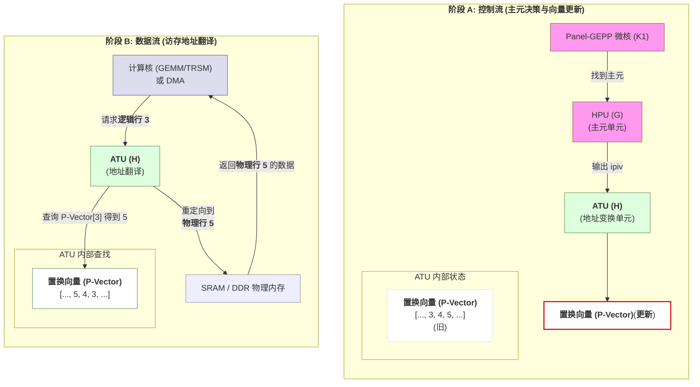
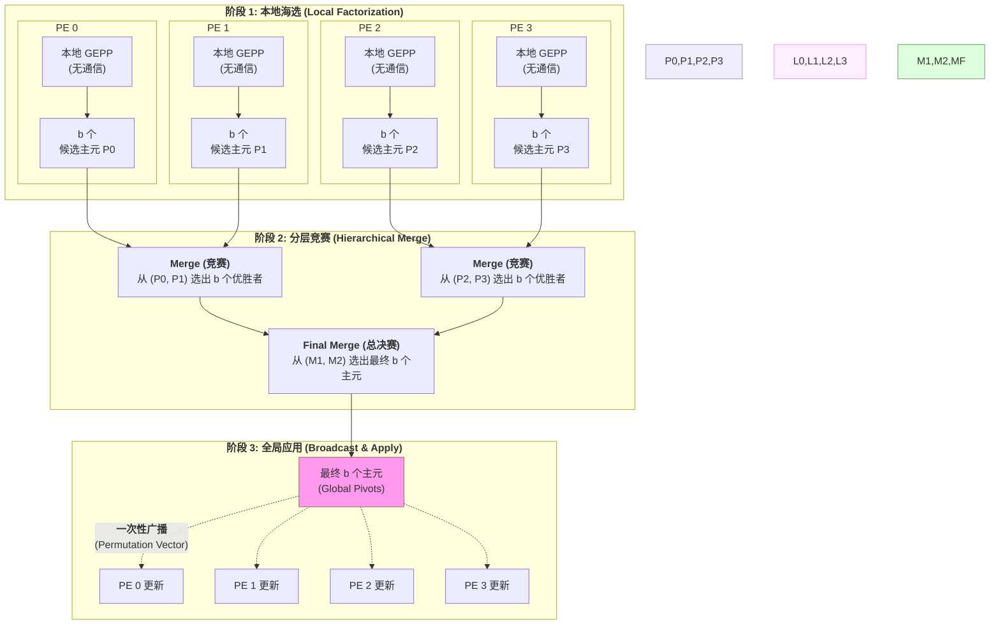
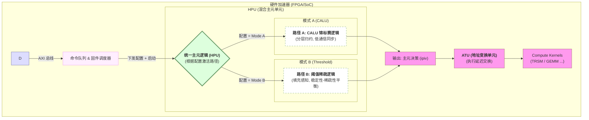
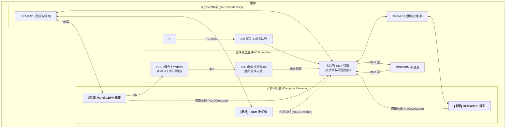

```mermaid
flowchart TD
    subgraph ControlFlow["<b>阶段 A: 控制流 (主元决策与向量更新)</b>"]
        direction TB
        K_Panel["Panel-GEPP 微核 (K1)"] -- "找到主元<br/>" --> HPU["HPU (G)<br/>(主元单元)"]
        HPU -- "输出 ipiv" --> ATU["<b>ATU (H)</b><br/>(地址变换单元)"]
        
        subgraph ATU_Internal ["ATU 内部状态"]
            P_Vector["<b>置换向量 (P-Vector)</b><br/>[..., 3, 4, 5, ...]<br/>(旧)"]
        end

        ATU --> P_Vector_New["<b>置换向量 (P-Vector)</b>(<b>更新</b>)"]
        
        style K_Panel fill:#f9e,stroke:#966
        style HPU fill:#f9e,stroke:#966
    end

    subgraph DataFlow["<b>阶段 B: 数据流 (访存地址翻译)</b>"]
        direction TB
        
        K_GEMM["计算核 (GEMM/TRSM)<br/>或 DMA"] -- "请求<b>逻辑行 3</b>" --> ATU_Translate["<b>ATU (H)</b><br/>(地址翻译)"]
        
        subgraph ATU_Lookup ["ATU 内部查找"]
             P_Vector_Current["<b>置换向量 (P-Vector)</b><br/>[..., 5, 4, 3, ...]"]
        end

        ATU_Translate -- "查询 P-Vector[3] 得到 5" --> P_Vector_Current
        
        ATU_Translate -- "重定向到<br/><b>物理行 5</b>" --> MEM["SRAM / DDR 物理内存"]
        
        MEM -- "返回<b>物理行 5</b> 的数据" --> K_GEMM
        
        style K_GEMM fill:#dde,stroke:#669
        style MEM fill:#eef,stroke:#99a
    end

    %% 样式
    style ATU fill:#dfd,stroke:#696
    style ATU_Translate fill:#dfd,stroke:#696
    style P_Vector fill:#fff,stroke:#ccc,stroke-dasharray: 2 2
    style P_Vector_New fill:#fff,stroke:#c00,stroke-width:2px
    style P_Vector_Current fill:#fff,stroke:#696
```

```mermaid
graph TD
    subgraph P0["PE 0<br/>(本地数据 A0)"]
        L0["本地 GEPP<br/>(无通信)"] --> C0["b 个<br/>候选主元 P0"]
    end
    subgraph P1["PE 1<br/>(本地数据 A1)"]
        L1["本地 GEPP<br/>(无通信)"] --> C1["b 个<br/>候选主元 P1"]
    end
    subgraph P2["PE 2<br/>(本地数据 A2)"]
        L2["本地 GEPP<br/>(无通信)"] --> C2["b 个<br/>候选主元 P2"]
    end
    subgraph P3["PE 3<br/>(本地数据 A3)"]
        L3["本地 GEPP<br/>(无通信)"] --> C3["b 个<br/>候选主元 P3"]
    end

    subgraph "<b>阶段 1: 本地海选 (Local Factorization)</b>"
        direction TB
        P0 & P1 & P2 & P3
    end

    subgraph "<b>阶段 2: 分层竞赛 (Hierarchical Merge)</b>"
        direction TB
        M1["<b>Merge (竞赛)</b><br/>从 (P0, P1) 选出 b 个优胜者"]
        M2["<b>Merge (竞赛)</b><br/>从 (P2, P3) 选出 b 个优胜者"]
        MF["<b>Final Merge (总决赛)</b><br/>从 (M1, M2) 选出最终 b 个主元"]
        
        C0 --> M1
        C1 --> M1
        C2 --> M2
        C3 --> M2
        
        M1 --> MF
        M2 --> MF
    end
    
    subgraph "<b>阶段 3: 全局应用 (Broadcast & Apply)</b>"
        direction TB
        FinalP["最终 b 个主元<br/>(Global Pivots)"]
        MF --> FinalP
        FinalP -. "<b>一次性广播</b><br/>(Permutation Vector)" .-> P0_Apply["PE 0 更新"]
        FinalP -.-> P1_Apply["PE 1 更新"]
        FinalP -.-> P2_Apply["PE 2 更新"]
        FinalP -.-> P3_Apply["PE 3 更新"]
    end

    style P0,P1,P2,P3 fill:#eef,stroke:#99a
    style L0,L1,L2,L3 fill:#fef,stroke:#e9e
    style M1,M2,MF fill:#dfd,stroke:#696
    style FinalP fill:#f9e,stroke:#966
```

```mermaid
flowchart TD
    subgraph "硬件加速器 (FPGA/SoC)"
        D -- "AXI 总线" --> E["命令队列 & 固件调度器"]
        E -- "下发配置 + 启动" --> HPU
        
        subgraph "HPU (混合主元单元)"
            direction LR
            HPU{"<b>统一主元逻辑 (HPU)</b><br/>(根据配置激活路径)"}
            
            subgraph "模式 A (CALU)"
                HPU_A["<b>路径 A: CALU 锦标赛逻辑</b><br/>(分层归约, 低通信同步)"]
            end
            
            subgraph "模式 B (Threshold)"
                HPU_B["<b>路径 B: 阈值稀疏逻辑</b><br/>(填充感知, 稳定性-稀疏性平衡)"]
            end

            HPU -- "配置 = Mode A" --> HPU_A
            HPU -- "配置 = Mode B" --> HPU_B
        end
        
        HPU_A --> R["输出: 主元决策 (ipiv)"]
        HPU_B --> R
        
        R --> ATU["<b>ATU (地址变换单元)</b><br/>(执行延迟交换)"]
        ATU --> K["Compute Kernels<br/>(TRSM / GEMM ...)"]
    end

    %% 样式

    style D fill:#ddf,stroke:#669
    style E fill:#fef,stroke:#e9e
    style HPU fill:#dfd,stroke:#696,stroke-width:3px
    style HPU_A fill:#fff,stroke:#696,stroke-dasharray: 5 5
    style HPU_B fill:#fff,stroke:#696,stroke-dasharray: 5 5
    style R fill:#f9e,stroke:#966
    style ATU fill:#f9e,stroke:#966
    style K fill:#f9e,stroke:#966
```

```mermaid
flowchart TD


    subgraph Accelerator["硬件"]
        
        B["AXI 接口 & 命令队列"]
        
        subgraph FW["固件调度层 (FW Scheduler)"]
            C["多队列 DMA 引擎<br/>(流式预取/写回融合)"]
            D["HPU (混合主元单元)<br/>(CALU 归约 / 阈值)"]
            E["ATU (地址变换单元)<br/>(维护置换向量)"]
        end

        subgraph Kernels["计算内核层 (Compute Kernels)"]
            K1["<b>[新增] Panel-GEPP 微核</b>"]
            K2["<b>[新增] TRSM 批式核</b>"]
            K3["<b>[复用] GEMM/TPU 阵列</b>"]
        end

        subgraph Mem["片上内存体系 (On-Chip Memory)"]
            M1["SRAM-S1 (面板双缓冲)"]
            M2["SRAM-S2 (更新双缓冲)"]
        end
        
        M_Off["DDR/HBM 多通道"]

        %% Dataflow
        A -- "PCIe/AXI" --> B
        B --> C
        C -- "DMA 读" --> M_Off
        M_Off -- "DMA 写" --> C
        
        C <--> M1
        C <--> M2
        
        M1 -- "数据" --> K1
        K1 -- "ipiv" --> D
        D -- "ipiv" --> E
        E -- "地址翻译" --> C

        M1 <--> K2
        M2 <--> K3
        
        K1 & K2 & K3 -- "内部总线 (NoC/Crossbar)" --> C
    end

    classDef mem fill:#eef,stroke:#99a
    class M1,M2,M_Off mem
```

