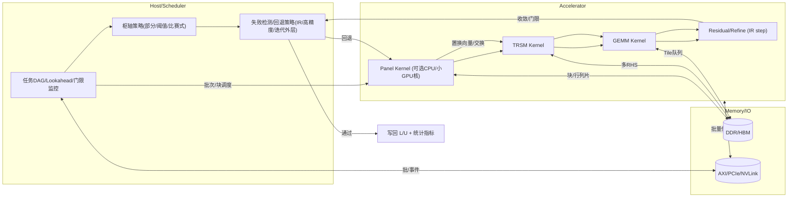

# 矩阵求解器（LU/多前/迭代法）研究背景与调研（开题报告用）

> **用途**：开题报告“背景&调研&切入点”章节的初稿，可直接粘贴到你的 LaTeX/Docs。包含你上传的 10 篇参考文献的归纳，以及 CPU/GPU/TPU/FPGA 方向的补充资料链接与可行研究路线。

---

## 0. 摘要（给答辩委员看的电梯陈述）
矩阵求解器是科学计算与机器学习系统的“发动机”。稠密问题常用块化 LU/QR，稀疏问题常用多前（multifrontal）/超节点（supernodal）技术；大规模场景下需要跨层优化：算法（稳定性/混合精度）× 数据布局（块/超块/前沿）× 硬件映射（CPU/GPU/TPU/FPGA）。现有系统在**面向异构硬件的端到端流水**、**枢轴策略与混合精度的协同鲁棒性**、以及**稀疏-稠密混合任务在 TPU/FPGA 上的可落地性**方面仍有明显不足（见第 4 节）。本课题拟提出“**算法—数据流—硬件共设**”方法：用可验证的块/波前分解，把 panel/TRSM/GEMM、枢轴与迭代改进（IR）编排进统一的数据流管线，并在 CPU/GPU/TPU/FPGA 上给出可复现实验基线。

---

## 1. 背景与关键概念

- **稀疏直接法：多前/超节点思想**  
  多前法将稀疏 Cholesky/LU 的全局消元重组为一系列对较小**致密前沿矩阵（frontal matrices）**的部分消元，通过**装配树/消去树**来组织更新与内存；实际实现常用**超节点**把相似结构的连续列聚成一块，以提升 BLAS‑3 亲和性与局部性。预处理包含：建树→等价重排序→最佳后序遍历→符号分解；随后基于树按前沿/更新矩阵推进数值分解与回代。大量文献强调**最后少数大前沿**对总开销的支配性与内存栈式管理策略的重要性。

- **稠密直接法：块化 LU（带部分枢轴）**  
  LAPACK 风格的块化 LU 将**panel 因子分解（DGETF2）**与**TRSM/GEMM 更新**解耦，通过 DAG/任务调度在 CPU/GPU 间分工（CPU 做同步密集的 panel+swap，GPU 吃 GEMM），并用 lookahead 与重叠传输掩蔽瓶颈。实践显示 panel 与通信常成为整体短板，需以调度与通信‑计算重叠化缓解。

- **迭代法与早期 GPU 求解：CG/多重网格**  
  早期工作将稀疏 CG 与多重网格映射到 GPU 的流处理模型，强调纹理打包、规约与规则/不规则网格下的数据结构选择，展示了 GPU 在结构化算例上的高吞吐潜力与带宽受限现象。

- **混合精度与迭代改进（IR）在加速器上的兴起**  
  现代 GPU/AI 加速器（Tensor Cores/TPU）用低精度完成主计算，再通过双/单精度 IR 矫正，提高吞吐同时保持精度与鲁棒性，对 LU/QR/Cholesky 适用并有端到端加速实例。

---

## 2. 你上传的 10 篇文献：要点速览（按主题分组）

> 注：以下标题以文件名+主题代称，正式论文建议配 BibTeX。

### 2.1 稀疏直接法 / 多前与超节点
- **[liu1992.pdf]**（SIAM Review 经典综述）  
  系统梳理多前法理论与实践，形式化**前沿/更新矩阵**与**装配树**；提出**超节点**提升密集核占比与局部性；指出**最后若干大前沿**占总算量较高，主导内存与时间。
- **[multifrontal.pdf]**（多前法中文资料/讲义）  
  以工程视角归纳**消去树/装配树/前沿堆叠**实现细节，便于与你后续的硬件流水拆解（写作时可直接配图/术语对齐）。

### 2.2 稠密块 LU × 异构加速
- **[vecpar2012_submission_4.pdf]**（多 CPU + 多 GPU 的块 LU）  
  CPU 负责 panel + 行交换，GPU 负责 DGEMM；使用 QUARK/任务图调度与 lookahead/通信重叠；展示了 **CPU panel（O(10^1) GF/s） 与 GPU GEMM（O(10^3) GF/s）** 的性能鸿沟及通信瓶颈。
- **[paper.pdf]**（与块化 LU/GPU 调度相关的资料）  
  补充面板‑更新三段式的任务图与数据移动模型。

### 2.3 迭代法 / 早期 GPU 线代
- **[bolz2003.pdf]**（SIGGRAPH’03：CG 与多重网格 on GPU）  
  讨论纹理化稀疏矩阵布局、规约算子与 GPU 流处理抽象；验证了结构化场景的高吞吐与带宽受限。

### 2.4 TPU/大规模分解
- **[ALX.pdf]**（TPU 上的大规模矩阵/推荐式分解工程）  
  强调**数据并行×模型并行**、**正交化/再参数化**与 **XLA 图优化**对吞吐与可扩展性的价值，给出端到端工程策略与代码指引。
- **[2112.09017v1.pdf]**（JAX/XLA & HPC 方向）  
  介绍 **XLA/TPU** 在科学计算中的潜力，提示将线性代数算子融合/并行以抑制内存交通的重要性。

### 2.5 混合精度 LU（Tensor Cores/GPU）
- **[2509.11529v1.pdf]**（混合精度/IR 相关近期研究，面向 GPU/AI 硬件）  
  总结低精度乘法 + 高精度累加/残差的实践与回退策略，给出误差‑性能权衡和端到端提速报告。

### 2.6 FPGA 上的块 LU
- **[Accelerating_LU-Decomposition_of_Arbitrarily_Sized_Matrices_on_FPGAs.pdf]**  
  以 128×128 PE 阵列实现块化 LU，展示与 MKL/torch.lu 的延迟与 GFLOPS 对比：**中小矩阵延迟优势**显著；大矩阵被高端 GPU 反超；管线受**除法/枢轴**影响，确定性强，适合实时/时延敏感场景。

### 2.7 其他：张量分解与“矩阵化”思路
- **[kuleshov15.pdf]**（AISTATS’15：随机投影+联合对角化）  
  用“降阶‑矩阵化”把张量分解化归为矩阵分解，强调**数值稳定与成熟矩阵核**的工程优势；这一思路可迁移到前沿/块的硬件映射。

- **[paper.pdf]**（若是你个人笔记/论文草稿）  
  可在正式开题中作为“自研/草案工作”的引用节点。

---

## 3. 新近/补充资料：CPU/GPU/TPU/FPGA 部署（可做 Related Work 与 baseline）

- **MUMPS v5.x 用户手册（MPI+OpenMP 稀疏直接）**  
  https://mumps-solver.org/
- **MAGMA（稠密分解：多核 CPU + GPU）**  
  https://icl.utk.edu/magma/
- **Intel oneMKL / PARDISO（CPU：稀疏/稠密）**  
  https://www.intel.com/content/www/us/en/developer/tools/oneapi/onemkl.html
- **NVIDIA cuSOLVER / cuSPARSE / cuDSS（GPU：稀疏/稠密）**  
  https://docs.nvidia.com/cuda/cusolver/  |  https://docs.nvidia.com/cuda/cusparse/  |  https://developer.nvidia.com/cudss
- **混合精度 IR（Haidar/Higham 等）**  
  入门综述与实现示例：https://epubs.siam.org/doi/10.1137/22M1487709 ；更系统化的概述：https://arxiv.org/abs/2406.16499
- **HPL‑AI（混合精度 Linpack）**  
  https://icl.utk.edu/hpl-ai/ ；https://www.top500.org/lists/hpl-ai/
- **JAX / XLA / TPU（图级融合与 Systolic 矩阵核）**  
  https://openxla.org/ ；https://jax.readthedocs.io/en/latest/

> 以上链接均为官方或权威资源，便于在 Related Work/Method 里引用与做 baseline 对照。

---

## 4. 现有工作的主要不足（结合我们之前的讨论，凝练成可落地的切入点）

1) **Panel / 枢轴成为异构流水短板**  
   在混合 CPU+GPU LU 中，panel 因子分解与行交换（含部分枢轴）同步与访存密集，显著慢于 GPU 上的 GEMM，形成**两级瓶颈**；需要通过 lookahead、通信重叠与**替代枢轴策略**缓解。

2) **多前/超节点的“最后几块”主导开销但缺少硬件化流水**  
   文献指出**最后几块大前沿**往往占据很高比例算量与内存，但主流开源库多在软件层面优化，**缺少将这些大前沿映射为稳定高吞吐数据流核**（GPU 的流调度或 FPGA 的可复用微架构）。

3) **TPU 生态对稀疏直接法与枢轴不友好**  
   TPU 的 systolic 核与 XLA 倾向大算子融合，对**不规则稀疏/动态枢轴/行交换**不友好；缺少“**TPU 友好 LU/IR**”范式（如**比赛式/阈值式枢轴**、pivot‑free + IR 的稳定边界）。

4) **混合精度的鲁棒性与回退策略工程化不足**  
   混合精度 LU + IR 需要**条件数/残差门限**与**自动回退**（至高精度或改用 GMRES/CG 的内外循环）策略；现有论文多给出算法/实验，但**系统层的统一阈值与监控**仍待完善。

5) **FPGA 抗时延但扩展性/除法与枢轴代价高**  
   FPGA 在中小矩阵延迟与确定性上优势明显，但面对超大矩阵/复杂枢轴/除法管线，常被高端 GPU 反超；**端到端分块‑调度‑访存**策略仍可深挖。

---

## 5. 你的可行研究路线（“工程可做 + 学术可发”）

**R1. “面向流水的 LU‑IR 共设”**  
把 `panel/permute`、`TRSM`、`GEMM`、`IR` 作为**可预测的算子流**，设计：  
- **（策略）** 采用**比赛式/阈值式枢轴**（减少同步）+ **失败检测与回退**（触发更强枢轴/高精度/迭代外层），用**条件数/残差门限**做在线监测；  
- **（调度）** 基于 DAG/QUARK 式调度在 CPU/GPU/TPU 上实现**lookahead + 通信/计算重叠**；  
- **（精度）** 系统化集成**混合精度 IR**（含停止准则与回退）成为可复现实验框架。

**R2. “TPU 友好 LU/IR” 原型**  
将 **枢轴与行交换**的控制外提到 host/scheduler，数据面保持大算子（GEMM/TRSM）与 **XLA 融合**，探索 pivot‑free 或**分段静态枢轴** + IR 的稳定域，给出 **TPU v5e/v4** 的可跑 baseline（JAX/XLA）。

**R3. “大前沿硬件核” 与多前法流水**  
针对**最后几块大前沿**，把 extend‑add/部分消元/更新路由成**固定形状的致密核**（Dense‑in‑the‑small），在 **GPU 流调度**或 **FPGA PE 阵列**上做**可复用微架构**，并与 MUMPS 等进行算例对照。

**R4. 统一评测与开放基线**  
选取**稠密**（LINPACK/HPL‑AI 类）与**稀疏**（SuiteSparse+工业网格）算例，横向对比 **MKL(oneMKL)/MAGMA/MUMPS/cuSOLVER/cuDSS/TPU**，统一**精度‑收敛‑吞吐‑能耗**指标，开源脚本与仪表盘。

---

## 6. 拟议实现架构（1 页数据流图，便于你验证与实现）

> 注：在 TPU 方案中，“Accelerator” 区域更多由 **XLA 融合算子**（GEMM/TRSM + custom‑call 规约）承载，panel/枢轴可上移到 Host/Scheduler，通过 static 计划与 IR 保证稳定。

---

## 7. 参考资料（将来可转 BibTeX）

**（你上传的 10 篇）**  

- *liu1992.pdf* — Liu, The Multifrontal Method for Sparse Matrix Solution（SIAM Review, 1992）。  
- *multifrontal.pdf* — 多前法中文资料/讲义。  
- *vecpar2012_submission_4.pdf* — Kurzak 等，多 CPU+GPU 的块 LU（VECPAR 2012）。  
- *paper.pdf* — 与块化 LU/GPU 调度相关的资料或你的草稿。  
- *bolz2003.pdf* — Bolz 等，Sparse Matrix Solvers on the GPU（SIGGRAPH 2003）。  
- *ALX.pdf* — TPU 上的大规模矩阵/推荐式分解工程实践。  
- *2112.09017v1.pdf* — JAX/XLA & HPC 方向（arXiv 2112.09017）。  
- *2509.11529v1.pdf* — 混合精度/IR 与加速器相关研究（arXiv 2025）。  
- *Accelerating_LU-Decomposition_of_Arbitrarily_Sized_Matrices_on_FPGAs.pdf* — FPGA 上的块 LU。  
- *kuleshov15.pdf* — Kuleshov 等，Tensor → Matrix 化的分解思路（AISTATS’15）。

**（补充/官方与近年资料）**  
- MUMPS：https://mumps-solver.org/  
- MAGMA：https://icl.utk.edu/magma/  
- Intel oneMKL / PARDISO：https://www.intel.com/content/www/us/en/developer/tools/oneapi/onemkl.html  
- NVIDIA cuSOLVER / cuSPARSE / cuDSS：  
  https://docs.nvidia.com/cuda/cusolver/ | https://docs.nvidia.com/cuda/cusparse/ | https://developer.nvidia.com/cudss  
- 混合精度 IR（Haidar/Higham 等）：https://epubs.siam.org/doi/10.1137/22M1487709 | https://arxiv.org/abs/2406.16499  
- HPL‑AI： https://icl.utk.edu/hpl-ai/ | https://www.top500.org/lists/hpl-ai/  
- OpenXLA / JAX / TPU： https://openxla.org/ | https://jax.readthedocs.io/en/latest/

---

### 附：下一步我能帮你做什么（任选其一）
- 生成 `.bib` 并把上文中的所有引用转为 BibTeX；  
- 出一版“开题 PPT 15 页骨架”（含 1 页图 + 3 页 Related Work 速览 + 3 页方法 + 4 页实验设计 + 1 页风险 & 里程碑 + 1 页总结）；  
- 把 **R1/R2/R3** 的实验清单和评测脚本（Makefile+Python）起一个仓库骨架。
