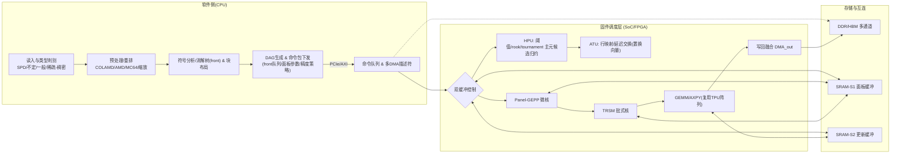

# 矩阵求解器：软硬协同加速方案（MD整理稿）

> 面向“前沿(front)密化 + 稠密三段式(panel–TRSM–GEMM)”的统一框架，兼顾稀疏/稠密路径、混合主元、通信规避与混合精度IR。本文档可直接作为开题/设计讨论底稿。

---

## 目录
1. 可选毕设题目（可组合）  
2. 架构合理性/严谨性/正确性评审（含必要纠错）  
3. 针对 8 个关键问题的逐条回答  
4. 软硬件总体架构（模块/数据流图）  
5. 可发表级创新点备选  
6. 分阶段实施与里程碑（建议节奏）  
7. 开题PPT大纲（要点）  
8. 快速复核清单  
9. 参考资料与链接

---

## 1) 可选毕设题目（供挑选/组合）
1. 面向混合精度与低延迟主元选择的 **LU 分解加速器**：软硬协同与多波前调度  
2. **稀疏/稠密统一路径** 的前端-后端解耦型矩阵求解器：固件调度与 TPU 算子复用  
3. **消解树驱动 Block-LU** 在 FPGA/TPU 上的实现：双缓冲访存与数值稳定性  
4. **通信规避（CALU）** 与静态+阈值混合主元在硬件上的实现：从分析到求解的一体化设计  
5. 面向 **矩阵求逆/多右端** 的 QR/LDLᵀ/LU 三路径协同与精度-能效优化  
6. **多通道DDR/片上SRAM分层** 的求解内存体系：流式 DMA、bank 轮转与写回融合  
7. 基于 **多波前法** 的稀疏前沿密化内核：面向 MUMPS/STRUMPACK 范式的硬件映射  
8. 软硬协同 **动态任务图（DTG）调度**：消解树-前沿-带宽三维约束下的鲁棒利用率

---

## 2) 架构合理性/严谨性/正确性评审（含必要纠错）

- **术语统一：MUMPS（非 NUMPS）**：多波前稀疏直接解法器的代表之一，支持 LU/LDLᵀ、分布式与外存处理；与 STRUMPACK 同属“前沿密化 + 数值分解/三角解”的范式。  
- **分析阶段在软件**（预处理/重排、符号分析、消解树）→ **数值分解在前沿上走稠密核**，是主流设计；STRUMPACK 已将 **数值分解与三角解迁移到 GPU**。  
- **主元选择**：稠密 GEPP（部分选主元）成熟；稀疏常用 **阈值/静态/匹配-缩放(MC64)** 等策略以减少通信与结构变动。  
- **通信规避**：CALU（tournament pivoting）在面板分解上显著降低同步/消息数；适用于硬件与分布式。  
- **混合精度 + 迭代改进(IR)**：以低精度(如 bf16/FP16)做分解、以高精度累加/残差校正，已形成 **HPL‑MxP/HPL‑AI** 的基准路线。  
- **按类型选分解**：SPD→Cholesky；对称不定→Bunch‑Kaufman( LDLᵀ )；一般矩阵→LU/QR；**QR/CAQR** 更稳、适合显式逆与正交需求。  
- **数据分布与负载均衡**：2D **block‑cyclic** 是并行数值线代的经典布局；硬件内建议 bank‑aware 轮转。

> 以上各点在第 9 节提供来源链接。

---

## 3) 针对你提出的 8 个问题逐条回答

**(1) 创新点在哪里？**  

- **混合主元链**：`MC64/重排(软件)` → `阈值/rook/tournament(面板)` → `行映射ATU延迟交换`，用地址重映射替代大规模物理交换。  
- **通信规避面板 (CALU-like)** + **TPU 核复用**：面板候选主元分层竞赛筛选；更新用 GEMM/AXPY 核，**双缓冲 DMA + 写回融合** 叠加计算与访存。  
- **混合精度 + IR**：分解用 bf16/FP16、累加/残差用 FP32/FP64，达成 **FP64 级数值质量 + 更高吞吐**。  

**(2) 大型矩阵的多次访存与负载均衡？**  

- **片上 SRM 双缓冲**：面板/更新各一套；**多队列 DMA** 喂数；写回融合减少往返。  
- **行映射 ATU + 置换向量**：把交换成本前移到地址层；DDR 避免大搬移。  
- **front 分级调度**：大 front/带宽优先；小 front **批式拼接** 成 mini‑panel 提升阵列利用率。  
- **2D block‑cyclic** 跨通道/Bank 轮转，均衡冲突。  

**(3) 是否需要 QR？**  

- 明确**显式逆/高稳健性**需求时建议 **QR/CAQR**；否则以 **“LU + 多右端 + IR”** 先覆盖多数应用，后续再扩展 QR。  

**(4) 稠密路径是否不需要消解树？**  

- 是。稠密直接走阻塞式 **panel–TRSM–GEMM**。软件负责输入类型识别与路径路由即可。  

**(5) 架构图与软硬划分？**  

- 见第 4 节“总体架构”与 Mermaid 图。  

**(6) 是否在核间设总线？**  
- 外设统一 **AXI4/AXI‑Stream** 合理；核到 SRAM/DMAX 建议 **直连/交叉开关/轻量 NoC**，避免共享总线仲裁瓶颈。  

**(7) 模块异步性？**  

- **五阶段全面重叠**：预取(DMA_in)/面板分解/三角求解/更新GEMM/写回(DMA_out)。主元搜索在下一列预取时并行。  

**(8) 是否新做一套脉动阵列？**  

- **优先复用已有 TPU 矩阵核**（GEMM/AXPY/点积），补 **TRSM/小规模 GEPP 微核** 与 **行映射 ATU** 即可；投入与风险比最优。

---

## 4) 软硬件总体架构（模块/数据流图）

### 4.1 分层描述
- **软件（CPU）**：读入/类型判别 → 预处理（COLAMD/AMD/MC64/缩放） → 符号分析/消解树(front) → 任务图(DAG)与块布局 → 下发固件命令包（front 队列、面板大小、精度策略） → 可选 IR（残差与校正）。  
- **固件调度**：拓扑序 + 内存就绪度 + 通道占用的多目标调度；**双缓冲**、**多 DMA 队列**、**写回融合**；**混合主元单元(HPU)** 输出 ipiv → **行映射 ATU** 完成延迟交换。  
- **计算内核**：Panel‑GEPP 微核（含阈值/rook 选主元）、TRSM（左右/上下/转置/批式）、GEMM/AXPY（复用 TPU 核）、小 front 批处理。  
- **内存/互连**：多通道 DDR/HBM + 片上 SRAM 两级双缓冲；AXI‑MM DMA 与 AXI‑Stream；直连/交叉开关/轻量 NoC。

### 4.2 模块/数据流

---

## 5) 可发表级创新点备选（摘要）
- **地址级延迟交换(ATU)**：以置换向量驱动地址变换，隐藏行交换。  
- **CALU‑like 面板**：tournament pivoting 降同步与消息数；与 2D block‑cyclic/双缓冲协同。  
- **混合精度 IR**：bf16/FP16 分解 + FP32/FP64 累加/残差，展示 HPL‑MxP 路线的性价比。  
- **统一三路径**（LU/LDLᵀ/QR）共享 DMA/缓冲/调度框架，仅替换面板/更新核。  
- **front 批式拼接** 与 **bank‑aware** 数据布局，提升阵列利用率与带宽利用率。

---

## 6) 分阶段实施与里程碑（建议）

**阶段 A（2–3 周） 基础设施**：主机读入/类型判别、预处理（可复用 SuiteSparse 调用）；设备端 DMA 收发、SRAM 双缓冲、命令队列。  
**阶段 B（4–6 周） 稠密路径**：阻塞 LU（panel–TRSM–GEMM），加入 **阈值主元 + ATU**；计数器：GFLOP/s、GB/s、阵列利用率、面板占比。  
**阶段 C（6–8 周） 稀疏‑前沿**：依消解树组织 front；小 front 批拼接与 bank‑aware 映射。  
**阶段 D（3–4 周） 混合精度 + IR**：bf16/FP16 分解、FP32/FP64 累加/残差；收敛性与精度评测。  
**阶段 E（3–4 周） 鲁棒性与对标**：对标 STRUMPACK/MUMPS/cusolverDN 稠密路径；消融：调度策略/front 分布。

---

## 7) 开题 PPT 大纲（要点提示）
1. **背景与挑战**：主元通	信与数据搬移是瓶颈；CALU/CAPR/TSQR 等“通信规避”路线；混合精度与 IR 的趋势。  
2. **相关工作**：MUMPS/STRUMPACK（前沿密化）、cuSOLVER（GEPP/QR/Cholesky/LDLᵀ）、HPL‑MxP。  
3. **总体架构**：软件分析→固件调度→核/内存层；ATU/HPU/双缓冲 DMA。  
4. **关键技术**：混合主元链、CALU‑like 面板、混合精度 IR、front 批拼接。  
5. **实现计划** 与 **评测指标**：GFLOP/s、GB/s、利用率、端到端延迟；矩阵套件与对标库。  
6. **预期成果**：论文/原型/脚本与可复现实验。

---

## 8) 快速复核清单
- [ ] 统一术语：MUMPS/STRUMPACK，多波前/前沿(front)  
- [ ] 输入类型自动判别与路径选择（SPD/不定/一般/稀疏/稠密）  
- [ ] 面板‑TRSM‑GEMM 三段式是否完全流化并双缓冲  
- [ ] HPU 主元与 ATU 行映射是否闭环（阈值参数可调）  
- [ ] 小 front 的批处理/拼接是否打通  
- [ ] IR 路线：残差阈值、迭代上限、失败回退策略  
- [ ] 评测脚本：端到端/核级/访存级计数器齐备

---

## 9) 参考资料与链接（精选）

### 多波前/稀疏直接解法器
- **MUMPS**：https://mumps-solver.org/  
- **STRUMPACK（GPU 版）**：论文摘要与 eScholarship 链接  
  - https://www.sciencedirect.com/science/article/abs/pii/S0167819122000059  
  - https://escholarship.org/uc/item/7tv84567  
- **STRUMPACK 概览（ECP）**：https://www.exascaleproject.org/highlight/strumpack-speeds-sparse-algorithms-on-cpus-and-gpus/

### 稀疏重排/缩放与主元策略
- **SuiteSparse（AMD/COLAMD/UMFPACK/CHOLMOD/SPQR）**：  
  - https://people.engr.tamu.edu/davis/suitesparse.html  
  - https://github.com/DrTimothyAldenDavis/SuiteSparse  
- **HSL‑MC64（匹配‑缩放）**：https://www.hsl.rl.ac.uk/specs/hsl_mc64.pdf  
- **SuperLU（阈值/静态主元）**：  
  - Users’ Guide：https://portal.nersc.gov/project/sparse/superlu/superlu_ug.pdf  
  - Tutorial（阈值/静态主元综述）：https://wordpress.cels.anl.gov/computingschool/wp-content/uploads/sites/28/2014/01/fastmath-superlu-atpesc-08-2014.pdf

### 通信规避（CALU/CAQR/TSQR 等）
- **CALU（LAWN#226，tournament pivoting）**：https://www.netlib.org/lapack/lawnspdf/lawn226.pdf  
- **CALU 实施细节（UTK）**：https://icl.utk.edu/files/publications/2022/icl-utk-1533-2022.pdf  
- **CAQR（LAWN#240/224、Berkeley TR）**：  
  - https://www.netlib.org/lapack/lawnspdf/lawn240.pdf  
  - https://www.netlib.org/lapack/lawnspdf/lawn224.pdf  
  - https://eecs.berkeley.edu/Pubs/TechRpts/2010/EECS-2010-131.pdf  

### 混合精度与迭代改进（IR）
- **HPL‑MxP/HPL‑AI**：  
  - 官网：https://hpl-mxp.org/  
  - 论文（2025）：https://arxiv.org/abs/2509.19618  
- **Carson & Higham 系列**：  
  - 综述/近期成果：https://arxiv.org/html/2406.16499v3  
  - SIAM（2023）：https://epubs.siam.org/doi/10.1137/22M1487709  

### 稠密库与算法参考
- **cuSOLVER（GEPP/QR/Cholesky/LDLᵀ/Bunch‑Kaufman）**：  
  - 在线手册：https://docs.nvidia.com/cuda/cusolver/index.html  
  - PDF 文档（13.0）：https://docs.nvidia.com/cuda/pdf/CUSOLVER_Library.pdf  
- **Bunch‑Kaufman/LDLᵀ**：  
  - SciPy ldl 文档：https://docs.scipy.org/doc/scipy/reference/generated/scipy.linalg.ldl.html  
  - 早期技术报告（可作背景）：https://ntrs.nasa.gov/api/citations/19890018970/downloads/19890018970.pdf  

### 并行数据布局
- **ScaLAPACK 用户指南**（2D Block‑Cyclic）：  
  - https://www.netlib.org/scalapack/slug/  
  - Block‑Cyclic 说明：https://www.netlib.org/utk/papers/sc96-scalapack/NODE8.HTM  
  - 本地存储映射细节：https://www.netlib.org/scalapack/slug/node76.html

### XLA/TPU 与 bfloat16（用于“混合精度+IR”的硬件背景）
- **OpenXLA / XLA 架构**：  
  - https://openxla.org/xla/architecture  
  - https://openxla.org/xla  
- **Cloud TPU bfloat16**：  
  - https://cloud.google.com/tpu/docs/bfloat16  
  - https://cloud.google.com/blog/products/ai-machine-learning/bfloat16-the-secret-to-high-performance-on-cloud-tpus  
- **TensorFlow 混合精度指引**：https://www.tensorflow.org/guide/mixed_precision

---

> 如需，我可以把本 MD 拆成“论文结构草案 + 架构图单页 + 实验脚本骨架（Makefile/pytest）”三份文件，方便你明天直接开工。
