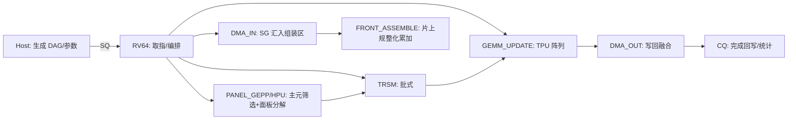

# 设备接口规范（工作队列 & 前沿组装一页稿）
版本：v0.1  | 状态：草案可实现  | 作者：czx/ChatGPT  | 目标硬件：RV64 简易 CPU + 简易 TPU 阵列 + AXI DMA

> 主机掌控 **策略/DAG**，固件（RV64）提供 **机制/推进**，TPU 负责 **算子吞吐**。本规范给出命令集、描述符、前沿组装“贡献清单”、状态机与错误/回退。

---

## 1. 队列与寄存器
- **SQ（Submission Queue）**：环形队列，元素 64B 对齐，长度建议 1024（可调）。
- **CQ（Completion Queue）**：环形队列，元素 32B 对齐，长度建议 2048（可调）。
- **Doorbell**：`DB_SQ_TAIL`（写入新尾）、`DB_CQ_HEAD`（主机读回收）。
- **Fence**：`FENCE_IO`（确保 DMA 完成可见）；`FENCE_SYS`（确保主机/设备视图一致）。

> 建议把 SQ/CQ 放在可 DMA 的共享内存区，减少 MMIO 访问开销。

---

## 2. 命令集（Opcodes）
| Opcode | 名称 | 说明/关键字段 |
|---|---|---|
| 0x01 | `DMA_IN` | SG（Scatter/Gather）读入，目标为片上 SRAM（面板/组装区）。 |
| 0x02 | `DMA_OUT` | SG 写回到主存（DDR/HBM），支持写回融合。 |
| 0x10 | `PANEL_GEPP` | 面板分解（GEPP），可选 `pivot_mode={threshold,rook,tournament}`。 |
| 0x11 | `HPU_PIVOT` | 可选：单独对候选块做主元筛选/阈值调整，产出 `ipiv`。 |
| 0x12 | `TRSM` | 三角求解（左/右、上/下、转置/非转置、批式）。 |
| 0x13 | `GEMM_UPDATE` | 采用 TPU 阵列做更新（支持 tile/batch 描述）。 |
| 0x14 | `SOLVE_FW` | 前代回代（可选批式多右端）。 |
| 0x15 | `SOLVE_BW` | 回代阶段。 |
| 0x20 | `SET_PREC` | 设置混合精度策略（bf16/FP16 分解 + FP32 累加 + FP64 残差）。 |
| 0x21 | `SET_PARAM` | 设置阈值、NB、prefetch 距离、batch 尺度等运行时参数。 |
| 0x30 | `BARRIER` | 流水线栅栏，确保 *之前* 命令完成。 |
| 0x31 | `MARKER` | 打时间戳/计数点。 |
| 0x40 | `SCRIPT_LOAD` | 装载当前会话的 **front DAG/脚本**（只缓存于设备侧，会话级 LRU）。 |
| 0x41 | `FRONT_BEGIN` | 指定 front 句柄，开始一次分解/更新流水。 |
| 0x42 | `FRONT_ASSEMBLE` | 执行“贡献清单”到 SRAM 组装区的汇入与规整化累加。 |
| 0x43 | `FRONT_COMMIT` | 将 front 因子/中间结果写回（写回融合）。 |

命令头统一：
```c
struct CmdHeader {
  uint8_t   opcode;     // 上表
  uint8_t   flags;      // bit0: int_en, bit1: strong_order, bit2: allow_retry, ...
  uint16_t  size_b;     // 整个命令字节数（含扩展区）
  uint32_t  rid;        // request id（回写到 CQ）
  uint32_t  dep_cnt;    // 依赖计数（可为 0）；
  uint64_t  dep_rid[4]; // 最多 4 个依赖，也可通过 BARRIER/MARKER 简化
};
```

---

## 3. 描述符格式（关键命令）

### 3.1 SG-DMA 描述符
```c
struct SgElem {
  uint64_t host_ptr;   // 主存地址（64B 对齐）
  uint32_t bytes;      // 长度（建议 256B 对齐，便于 burst）
  uint32_t rsvd;
};

struct DmaInDesc {
  struct CmdHeader h;
  uint64_t sram_ptr;     // 片上 SRAM 目标起址（64B 对齐）
  uint32_t elem_cnt;     // SgElem 数量
  uint32_t stream_id;    // AXI-Stream/通道选择
  struct SgElem elems[]; // 可变长
};
// DmaOutDesc 同理（将 sram_ptr 作为源，host_ptr 作为目标）
```

### 3.2 `GEMM_UPDATE` Tile 描述
```c
struct GemmTile {
  uint64_t A_ptr;  uint32_t lda;  uint32_t m;
  uint64_t B_ptr;  uint32_t ldb;  uint32_t n;
  uint64_t C_ptr;  uint32_t ldc;  uint32_t k;
  float alpha; float beta;        uint32_t tflags; // transA/B, acc_type, batch_id
};

struct GemmUpdateDesc {
  struct CmdHeader h;
  uint32_t tile_cnt;
  struct GemmTile tiles[]; // 批式提交
};
```

### 3.3 `PANEL_GEPP` & `TRSM`
```c
struct PanelGeppDesc {
  struct CmdHeader h;
  uint64_t panel_ptr;   // 面板所在 SRAM 起址
  uint32_t m, n;        // 面板尺寸（一般 n=NB）
  uint32_t ld;          // leading dim
  float    tol;         // 阈值（阈值主元）
  uint8_t  pivot_mode;  // 0:threshold 1:rook 2:tournament
  uint8_t  nb;          // 建议 128/256
  uint16_t rsvd;
  uint64_t ipiv_ptr;    // pivot 索引输出（SRAM）
};

struct TrsmDesc {
  struct CmdHeader h;
  uint64_t A_ptr; uint64_t B_ptr;
  uint32_t m, n, lda, ldb;
  uint8_t  side, uplo, trans; // 0/1
  uint8_t  batch;             // 批式时的批大小提示
  uint16_t rsvd;
};
```

---

## 4. 前沿组装“贡献清单”（Contribution List）

**目的**：把多个子前沿的稀疏贡献块（不连续片段）**以 SG-DMA** 汇入 **SRAM 组装区**，在片上做规整化累加，避免 DDR 上的细粒度随机写。

```c
struct ContribItem {
  uint64_t src_ptr;     // 源（主存）地址
  uint32_t rows, cols;  // 贡献块大小
  uint32_t src_ld;      // 源行跨距
  uint32_t dst_r0;      // 目标 front 组装区起始行（相对偏移）
  uint32_t dst_c0;      // 目标 front 组装区起始列（相对偏移）
  float    alpha;       // 可选：缩放系数（默认 1.0）
  uint32_t rsvd;
};

struct FrontAssembleDesc {
  struct CmdHeader h;
  uint64_t front_sram_ptr; // 目标 front 的 SRAM 组装区
  uint32_t item_cnt;
  struct ContribItem items[]; // 可变长
};
```

**示例：三子前沿汇入父前沿**
```text
父 front 维度 = 384x384, NB=128
- 子#1 影响 [0:192, 0:128]
- 子#2 影响 [64:320, 128:256]
- 子#3 影响 [256:384, 256:384]
→ 生成 3 条 ContribItem，交由 `FRONT_ASSEMBLE` 执行
```

---

## 5. 有序流水与状态机（Mermaid）


---

## 6. 对齐/对数与约束
- **对齐**：host_ptr/sram_ptr 建议 **64B** 对齐；bytes 建议 **256B** 倍数以获得满速 burst。
- **大小**：面板 `NB` 建议 **128/256** 两档；`rows*cols` 不超过单次 SRAM 组装区容量。
- **端序**：LE（小端）。
- **精度**：低精度（bf16/FP16）乘法 + FP32 累加；残差/规范化在 FP64。

---

## 7. 错误码与快速回退
| code | 说明 | 回退策略 |
|---|---|---|
| 0 | OK | |
| 1 | DMA_FAULT | 复位通道/重投递 |
| 2 | PIVOT_UNSTABLE | 提高 `tol`、切换 `pivot_mode`、或 NB 减小重试 |
| 3 | OOM_SRAM | 降低 batch/分块重排 |
| 4 | PRECISION_UNSUP | 切换到 FP32/FP64 |
| 5 | SCRIPT_MISS | 主机重下发 DAG/脚本 |
| 6 | TIMEOUT | 分析 CQ/硬件计数器并复位流水 |

---

## 8. 批小 front 的例子（伪指令序列）
```text
SET_PARAM {NB=128, prefetch=2, batch_small_front=16}
SET_PREC  {mode=bf16_acc32_res64}

FRONT_BEGIN {handle=F1}
FRONT_ASSEMBLE {list=L1}   ; SG-DMA 汇入 → SRAM 累加
PANEL_GEPP {panel=P1}
TRSM { ... }
GEMM_UPDATE { tiles=[...] }
FRONT_COMMIT

; 立刻批跟进小 front（同一批次共享一次 kernel 启动与 SRAM 复用）
FRONT_BEGIN {handle=F2} ...
...
BARRIER
```

> 以上字段与结构均为工程友好型初稿，可直接落代码；后续与 RTL/驱动对齐时再微调位宽与保留位。