# 面向对称符号包络的多前沿稀疏 LU 求解器：总体架构重新定型方案

状态：六个月交付周期下的架构定型稿，待确认后作为新的项目主线

本文不是对旧 README、开题稿或 ABI 的补丁，也不是代码实现计划的简单汇总。它从多前沿方法的数学事实、当前代码证据和毕业设计的可验证性重新定义项目边界。旧文档只作为参考或历史记录；本文中的“决定”需要用户确认后，才成为后续代码和论文的唯一架构依据。

## 0. 先给结论

### 项目正式名称

**面向对称符号包络的多前沿稀疏 LU 求解器软硬件协同架构**。

### 一句话范围

对一般稀疏方阵的数值部分允许非对称，软件用 `pattern(A) ∪ pattern(A^T)` 构造保守的方形 front 和依赖树；SystemC 对 GCU、存储、动态主元、Panel-LU、块 TRSM、Schur/GEMM 和求解流程建立可执行的周期级架构模型，Verilog/SystemVerilog 完成边界明确的核心数据通路 RTL 原型，最终前代/回代复用 TRSM 语义在 SystemC 中闭环，硬件 RTL 求解作为后续扩展。

### 最终架构决定

| 问题 | 决定 |
|---|---|
| 正式求解对象 | `Ax=b`。显式逆矩阵只是对单位矩阵的多 RHS 重复求解，不是主工作负载。 |
| 矩阵范围 | 方形、稀疏、数值可对称或非对称；符号分析使用对称包络。不是完整一般非对称 multifrontal LU。 |
| 软件职责 | 作为“稀疏求解编译器”完成 ordering、fill、树/front、映射、数值策略和命令编译。 |
| 硬件职责 | 执行命令流，管理依赖/缓冲/搬运，并完成节点内 Panel-LU、TRSM、GEMM-Schur 的功能和时序闭环。 |
| SystemC 交付 | 全部核心模块均采用显式接口、状态机、片上 buffer 和周期/反压模型；黄金 C++ 只保留为独立参考。 |
| RTL 交付 | 完成 GCU、HPU、ATU、buffer/存储接口的 RTL 原型；INT32 GEMM 若暂无 RTL，则以可替换的 SystemC 行为/周期模型交付，量化/反量化作为独立适配边界。Panel-LU/TRSM 的完整浮点数据通路首先在 SystemC 中闭环，不强迫为其新增浮点 RTL。 |
| 最终求解 | SystemC 必须完成前代/回代端到端闭环；RTL 侧复用 TRSM 数据通路实现 block-RHS 求解作为增强项，不把单 RHS 树形求解作为首版 RTL 门槛。 |
| 软硬件接口 | “命令流 + 可扩展描述符”混合接口，不继续扩张固定字段型 `NodeTask`。 |
| 数值主路径 | FP64 软件黄金路径 + FP32/FP64 SystemC 设备路径；INT32 只作为 GEMM 的局部 RTL 适配路径，不把 BFP scale 传播到整个消除树。 |
| FP8 | 不作为首版主路径，只能作为 GEMM-only 对比实验，且必须有更高精度累加和 Panel/TRSM 保护。 |
| 主要架构创新 | 命令/数据解耦、HPU+ATU 的地址级动态主元、依赖感知的节点执行、浮点 SystemC 求解路径与 INT32 GEMM RTL 的局部精度隔离。 |
| 最小硬件闭环 | SystemC 中完成 GCU、HPU、ATU、buffer、Panel-LU、TRSM、GEMM 和 solve；RTL 中完成控制/地址路径，INT32 GEMM 使用同接口的 SystemC 行为模型，未来可无缝替换为 Verilog，使用同一 command/descriptor 语义验证。 |

这里的“完整”是架构和功能闭环意义上的完整，不是任意规模、任意精度、可直接流片的产品级实现。SystemC 中的 Panel-LU/TRSM 必须是真实的周期级数据通路模型；RTL 侧不再为了适配 INT32 GEMM 而强行实现一套全局定点 LU。论文应明确区分“SystemC 浮点求解器架构模型”和“INT32 GEMM 及控制路径 RTL 原型”，不能把局部 RTL 联调表述成完整浮点求解器 RTL。

### 六个月可行性判断

以当前代码基础和“不追求极致性能”为前提，目标**可行**，但必须接受以下定义：SystemC 是全系统的主验证平台，RTL 是受限规模的硬件实现与交叉验证平台；二者共享命令语义、descriptor 语义和数据布局，不要求 SystemC 直接自动生成 Verilog。

六个月内可交付的内容分为三层：

| 层次 | 六个月目标 | 可行性 |
|---|---|---|
| 系统架构 | 所有核心模块在 SystemC 中使用显式 buffer、握手、状态机、资源占用和周期模型运行；完成分解到求解闭环 | 高，当前已有调度、DDR、HPU/ATU 和数值基础 |
| 硬件原型 | GCU、HPU、ATU、buffer/存储接口和局部量化适配形成控制闭环；INT32 GEMM 先由 SystemC 行为/周期模型实现，RTL GEMM 作为可插拔增强 | 高，前提是明确没有 RTL GEMM 时不能声称完成 RTL 数值核 |
| 通用产品级实现 | 任意规模、任意非对称矩阵、完整 DDR/PCIe、全精度和高性能流水线 | 不作为本项目目标 |

因此，六个月计划不是“把所有 C++ 函数翻译成 Verilog”，也不是“让 INT32 量化贯穿整棵消除树”，而是把当前 SystemC 的计算后端重构为真正的浮点硬件数据通路模型，再把稳定、边界清晰的 INT32 GEMM 子路径落到 RTL。

## 1. 重新盘点后的证据

### 1.1 原理证据

论文第二章已经给出本项目真正需要的数学主线：稀疏直接法分成符号分析和数值分解；多前沿通过 front、update、消去树和 extend-add 把全局稀疏计算组织成局部矩阵计算；节点内按 `F11/F12/F21/F22` 完成局部 LU、TRSM 和 Schur 更新；求解阶段复用三角因子完成前代和回代。详见 [毕业论文第二章](毕业论文.docx) 的第 2.1--2.4 节，渲染页约 4--12 页。

Liu 的奠基文章给出的可迁移事实是：

- front 是局部稠密工作矩阵，update 是已消元子树对剩余变量的聚合贡献；
- 子树 update 通过 extend-add 形成父 front；
- supernode 把连续列合并为一个局部矩阵单元，便于全矩阵运算；
- front 级并行来自不相交子树，节点内并行来自 front/update 的块运算；
- full-matrix partial factorization、local index 和 stack/buffer 管理是实际实现的关键。

这些结论来自论文印刷页 83--86、90--92、100--106（对应 PDF 页约 2--25），见 [多波前方法的奠基文章](graduation-project/参考文献/多波前方法的奠基文章.pdf)。但这篇文章的正式对象是 SPD/Cholesky；其结尾还特别指出，一般非对称系统的 multifrontal 处理成功有限，稳定 pivot 可能要求扩大 front 或延迟消元。因此它支持“组织方式”，不自动支持本项目声称的完整非对称 LU。

### 1.2 当前代码事实

当前主线软件已经具备较高的复用价值：

- `software/src/pipeline.py` 已经把均衡、符号分析、supernode、front、`A_local`、map、量化、任务和 `memory_image.bin` 串起来；
- `software/src/symbolic/fill.py` 与 `ordering.py` 已经使用 `pattern(A) ∪ pattern(A.T)` 的符号语义；
- SystemC 已经有 HPU/ATU、front 装配、FP64/定点数值核、树形求解、DDR 事务统计和 CTest 端到端流程；
- 现有 ABI v2 的 `NodeTask` 是固定 128 字节，适合证明当前工具链，但其字段直接暴露 front 地址、尺寸、map 和写回区域，不能继续作为长期抽象；
- `hardware/GCU/gcu_top.sv` 仍为空顶层；`gcu_micro_scheduler.sv` 中 F12/F21/Schur 是 placeholder；`hardware/ATU/ATU.sv` 自己标注为 placeholder；HPU 的两个基础 testbench 仍为空。

当前验证状态也要准确表述：从 `graduation-code/software` 目录运行的软件测试通过，现有 SystemC CTest 3/3 通过；从仓库根目录直接运行 pytest 会因 v1/v2/v3 和主线存在同名测试模块而发生 collection mismatch。这不是算法失败，但说明仓库历史派生版本尚未被隔离成清晰的测试边界。

### 1.3 当前 SystemC 的真实性边界

当前 SystemC 的 `load_system_memory()` 会在仿真启动前把 front、map 和参考数据读入 `SystemMemory`；`KernelDispatcher` 随后主要消费这些 C++ 容器，而不是每个算子都从 DDR 字节区域重新读入。与此同时，写回和 DDR 延迟仍被建模。因此当前模型适合称为：

> 真实软件产物驱动的功能对象模型 + DDR/事务影子模型。

它还不能直接称为“RTL 等价的字节级硬件数据通路”。新的 SystemC 规范必须把 device path 和 golden checker 分离，避免 FP64 参考数据、预先计算的 pivot 或 C++ 缓存绕过设备接口。

## 2. 数学边界：支持什么，不支持什么

### 2.1 正式问题定义

主问题是求解：

$
Ax=b,\qquad A\in\mathbb{R}^{n\times n},
$

其中 `A` 是稀疏方阵，数值上允许对称或非对称。一次分解得到的因子可服务于多个 RHS：

$
PAQ = LU \quad\Longrightarrow\quad Ax=b
$

中的行/列置换由软件 ordering 和节点内数值 pivot 共同决定。若要显式求逆，只需把 `b` 换成单位矩阵的各列并重复三角求解；不形成 `A^{-1}` 应作为架构默认。

### 2.2 正式支持域

本项目选择下面的范围：

> **对称符号包络驱动、支持非对称数值矩阵的保守 multifrontal LU 原型。**

软件构造：

$
S=\operatorname{pattern}(A)\cup\operatorname{pattern}(A^T),
$

并在 `S` 上做 ordering、fill、消去树/森林、supernode、front 和 map。数值 front 仍来自原始 `A`，不能因为符号包络而把 `A` 数值对称化。

这一选择的含义是：

- `A` 的非零方向性保留；
- `S` 可能高估 fill 和 front，但目标是避免漏掉非对称 LU 的潜在结构传播；
- 同一对称 ordering 用于行列坐标，数值层首先支持当前 front 内的行 pivot；
- front 为静态方形，pivot 搜索默认只在当前 pivot 行集合内进行；
- 不支持 update 行成为新 pivot、delayed pivot、动态 front 扩张、独立行/列 matching 和完整的行列置换搜索。

因此“矩阵非奇异”不等于“一定被本项目支持”。遇到无安全 pivot、pivot 位于 update 行、front 超过硬件上限或低精度溢出时，系统必须报告数值失败或请求软件重编译/精度救援，不能用 `status=ok` 掩盖。

### 2.3 节点数学接口

装配后的节点 front 划分为：

$
F=\begin{bmatrix}F_{11}&F_{12}\\F_{21}&F_{22}\end{bmatrix}.
$

节点内采用带当前行置换的块 LU：

$
P_kF_{11}=L_{11}U_{11},\qquad
U_{12}=L_{11}^{-1}(P_kF_{12}),
$

$
L_{21}=F_{21}U_{11}^{-1},\qquad
S=F_{22}-L_{21}U_{12}.
$

`S` 是发送到父节点的 update。软件必须保证每个原始数值元素在唯一 `A_local` 中出现，子节点 update 只通过 map extend-add 到父 front；这样硬件才不会重复装配或丢失数值贡献。

## 3. 总体软硬件架构

```mermaid
flowchart LR
    A[原始稀疏 A 与 RHS] --> B[Host 稀疏求解编译器]
    B --> B1[结构包络 / ordering / fill]
    B1 --> B2[消去森林 / supernode / front / map]
    B2 --> B3[数值策略 / BFP 参数 / 命令编译]
    B3 -->|Command stream + descriptors| C[设备 DDR]

    subgraph DEV[SystemC/RTL 设备模型]
      D[GCU: fetch / wait / dependency / buffer]
      E[QAU/Assembly: extend-add / scale align]
      F[HPU + ATU: pivot reduce / logical-physical map]
      G[Panel-LU + TRSM engine]
      H[INT32 GEMM + local precision adapter]
      I[Writer: factor / update / completion]
      D --> E --> F --> G --> H --> I
      I --> D
    end
    C <--> D
    I --> J[Factor / update DDR]
    J --> K[SystemC/Host tree solve]
    K --> L[Golden checker: residual / backward error / solution error]
    C --> DEV
```



### 3.1 软件：稀疏求解编译器

软件负责所有需要全局结构知识或复杂策略的工作：

1. 输入检查、RHS 管理、原始 `A` 保存；
2. 可选的行/列均衡、ordering、符号包络和 fill 预测；
3. 消去树/森林、supernode/front 划分和工作区规划；
4. `A_local` 唯一归属、child update 到 parent front 的局部 map；
5. 生成多种 precision policy，而不是只生成一种 INT32 数据；
6. 把节点 DAG 编译为稳定 opcode 序列和可变描述符；
7. 生成 manifest、黄金参考和校验哈希；
8. 处理设备数值失败、精度升级、重试和最终 residual。

软件的输出不再理解为“硬件需要的若干字段”，而理解为一个可以被不同版本硬件执行的**求解程序包**：命令流描述做什么，描述符描述在哪些数据上做以及如何解释数据。

### 3.2 硬件：执行器而不是符号分析器

硬件负责：

- 命令获取、解析、合法性检查和完成回写；
- 依赖 token、buffer 生命周期、DMA/片上 SRAM 调度和反压；
- front/update 的搬运和在线 extend-add；
- HPU 主元候选归约、ATU 行映射；
- Panel-LU 的乘子生成、行更新和局部 pivot 流程；
- 两类块 TRSM；
- 复用矩阵乘阵列进行 Schur/GEMM 更新；
- 因子、update、状态和计数器写回。

硬件不负责：符号分析、ordering、动态构造消去树、原始矩阵 residual、黄金参考解、论文统计解释和大规模软件回退策略。

## 4. 分解和求解应该如何分工

### 4.1 为什么首版不把最终求解完全放进硬件

对单次分解 + 单个 RHS，分解阶段包含大量 front 级矩阵计算、装配和 update；最终树形前代/回代则具有以下特征：

- 每个节点只处理一个向量或很少 RHS，矩阵-向量算术强度低；
- 依赖沿树传播，难以持续喂满矩阵核；
- 需要按节点的 `P/L/U` 和局部 map 做不规则 gather/scatter；
- 为了求解而新增向量核、向量格式、写回和异常通路，会扩大 RTL 验证面；
- “把求解也做进硬件”本身没有解决当前最核心的分解瓶颈。

因此首版决定是：

- **硬件正式加速目标：分解阶段**，包含节点内 `F11` Panel-LU、`F12/F21` TRSM 和 `F22` Schur 更新；
- **SystemC 正式功能闭环：分解 + 树形求解**，保证项目仍然是完整求解器；
- **Host 正式交付路径：最终前代/回代、residual、迭代求精、失败重试**；
- **可选扩展：当 `nrhs` 达到设定阈值时，下发 block-RHS `TRSM_FORWARD/BACKWARD`，但不进入首版 RTL 验收门**。

### 4.2 三种工作负载的处理

| 工作负载 | 分解 | 求解 | 结论 |
|---|---|---|---|
| 单次分解 + 单 RHS | 设备 | Host/SystemC | 首版正式路径，硬件收益集中在分解。 |
| 单次分解 + 多 RHS | 设备 | SystemC，之后可设备批处理 | 只有 RHS 足够多时才值得增加求解硬件。 |
| 显式逆矩阵 | 设备分解 | 多 RHS/block TRSM | 作为扩展实验，不把显式逆写成主目标。 |
| 同结构重复数值分解 | 重用符号产物，设备重复数值分解 | Host/SystemC 或批处理 | 是最适合体现“软件编译器 + 可复用命令流”的场景。 |

## 5. 软硬件交互物：命令流 + 描述符

### 5.1 三种接口比较

| 方案 | 优点 | 主要问题 | 结论 |
|---|---|---|---|
| 纯 `NodeTask` | 简单，当前代码已有 128B ABI | 字段和算法阶段耦合；每次新增 precision、tile、写回语义都要改 ABI 和硬件；无法表达一个节点的操作顺序 | 保留为迁移兼容格式，不作为长期接口。 |
| 纯低层指令流 | 软件优化空间大，硬件只执行指令 | 指令携带大量地址/尺寸/map，命令带宽大；软件容易直接依赖微架构；错误检查困难 | 不采用。 |
| 命令流 + 描述符 | opcode 稳定，数据布局可扩展；命令带宽可控；适合可变 front 和 precision policy | 需要 descriptor table、版本和合法性检查 | **采用。** |

### 5.2 接口原则

1. 命令流只表达语义动作和执行依赖，不把 `F12` 的每一个地址字段硬编码在 GCU 状态机里。
2. 描述符保存尺寸、地址、leading dimension、tile、map、scale 和异常策略。
3. 描述符使用 `descriptor_id + version + length + TLV/extension`，新字段追加而不是改变旧字段含义。
4. 所有设备路径都消费 DDR 字节和 descriptor，不读取 Host 指针。
5. 命令完成必须产生 `command_id/node_id/status/counters`；数值失败与控制失败分离。
6. 同一 command stream 必须能被 SystemC 和 RTL 共同解释，不能为 SystemC 另写一套“直接调用 C++ 函数”的控制路径。

### 5.3 推荐的抽象格式

下面是语义格式，不是当前就要冻结的 bit-level ABI：

```text
CommandHeader {
    opcode          // NODE_BEGIN, PANEL_LU, TRSM, GEMM_UPDATE, ...
    version         // command schema version
    flags           // precision, retry, barrier, direction
    byte_length     // command record length
    command_id      // completion correlation
    node_id
    descriptor_id
    wait_token      // dependency token or zero
    signal_token    // completion token or zero
}
```

最小 opcode 集合：

```text
NODE_BEGIN
WAIT_DEP
LOAD_FRONT
ASSEMBLE_EXTEND_ADD
PANEL_LU
TRSM_LEFT
TRSM_RIGHT
GEMM_SCHUR
STORE_FACTOR
STORE_UPDATE
NODE_COMMIT
ABORT_NODE
SOLVE_FORWARD
SOLVE_BACKWARD
```

`SOLVE_FORWARD` 和 `SOLVE_BACKWARD` 首先作为 SystemC 的端到端求解命令；RTL 侧可在 TRSM 数据通路稳定后，把它们限制为 block-RHS 版本。这样求解阶段拥有稳定的软硬件语义，但不会强迫首版实现复杂的单 RHS 消除树控制。

描述符至少包括：

- `FrontDesc`：front base、总维度、pivot 维度、tile 大小、leading dimension、pivot 区和 update 区；
- `ContributionDesc`：source region、child update region、相对 row/column map、元素计数；
- `KernelDesc`：算子方向、tile 坐标、累加位宽、精度 policy、启动/完成 token；
- `ScaleDesc`：源 exponent、目标 exponent、对齐、舍入、溢出策略；
- `FactorDesc`：L/U/P 写回区域、因子格式、指数元数据和 rescue 标志。

### 5.4 一个节点的命令序列

```text
NODE_BEGIN       node=17  desc=front17  signal=t17_begin
WAIT_DEP         node=17  wait=child_tokens(4,9,12)
LOAD_FRONT       desc=front17          signal=t17_loaded
ASSEMBLE_EXTEND_ADD desc=map17         wait=t17_loaded signal=t17_assembled
PANEL_LU         desc=panel17          wait=t17_assembled signal=t17_panel
TRSM_LEFT        desc=f12_17           wait=t17_panel signal=t17_u12
TRSM_RIGHT       desc=f21_17           wait=t17_panel signal=t17_l21
GEMM_SCHUR       desc=schur17          wait=(t17_u12,t17_l21) signal=t17_update
STORE_FACTOR     desc=factor17         wait=t17_panel
STORE_UPDATE     desc=update17         wait=t17_update signal=t17_commit
NODE_COMMIT      node=17  wait=t17_commit
```

软件可以把 `TRSM_LEFT` 和 `GEMM_SCHUR` 改成更细的 tile 命令，也可以在未来用一个融合 opcode 替代；只要语义和 descriptor version 兼容，GCU 不需要知道软件内部的 supernode 生成算法。

### 5.6 从现有 `NodeTask` 迁移到命令流

迁移不采用一次性重写。现有 `NodeTask`、manifest 和 map 继续保留为软件内部的任务图表示，由新增的 command compiler 将其转换为设备可见的命令流：

```text
NodeTask / 消除树 / front 描述
              ↓
       Command Compiler
              ↓
command ring + descriptor table + data image
              ↓
     SystemC 或 RTL device executor
```

硬件只读取 command ring、descriptor table 和数据 buffer，不读取 `NodeTask` 的算法字段。命令采用两级语义：软件下发 `PANEL_LU`、`TRSM`、`GEMM_SCHUR` 等宏指令，GCU 在设备内部展开为 pivot、ATU swap、load、compute、store 等微操作。这样软件可以改变 supernode 构建和 tile 切分方式，而不必改变硬件的宏指令语义；但如果引入新的数值算子，仍然必须增加 opcode 或 descriptor 版本，不能宣称完全消除软硬件兼容工作。

首版建议使用固定大小的 command record 和独立 descriptor table。命令记录只放 opcode、版本、token、ID 和 descriptor 引用，尺寸、地址、stride、map、scale、异常策略放到 descriptor 中。具体 bit-level ABI 在 M0 冻结前不锁死，避免在尚未完成数据通路前反复改字段。

### 5.5 异常语义

至少区分：

```text
OK
BAD_COMMAND / BAD_DESCRIPTOR
ADDRESS_FAULT / BUFFER_FULL
DEPENDENCY_ERROR
PIVOT_NOT_FOUND
PIVOT_UNSTABLE
NUMERIC_OVERFLOW
QUANTIZATION_SATURATION
PRECISION_RETRY
TIMEOUT
```

`PIVOT_NOT_FOUND`、`PIVOT_UNSTABLE`、`NUMERIC_OVERFLOW` 和 `PRECISION_RETRY` 是数值状态，不得伪装成 GCU deadlock；`BAD_DESCRIPTOR` 和 `ADDRESS_FAULT` 是接口/存储错误；`TIMEOUT` 只表示控制流没有按预期完成。

## 6. 硬件微架构决定

### 6.1 GCU：命令和资源控制骨架

GCU 保留，但重新定义为命令执行器：

- Command Fetch：从 command buffer 读取并校验 header；
- Dependency Scoreboard：用 token 追踪 child update 是否完成，不依赖固定的 `children_count` 字段语义；
- Buffer Manager：管理 front、update、panel 和写回 buffer 的占用与生命周期；
- Resource Scheduler：在 Panel、TRSM、GEMM、DMA 之间发射 ready command；
- Completion/Counter：回写状态、周期、bytes、pivot、overflow、rescue 计数。

当前 GCU 子模块可以复用思想和测试，但不能直接把当前 `gcu_top.sv` 当成已集成硬件：顶层为空，`gcu_types_pkg.sv` 仍有 4-bit 地址/维度的早期示例，`gcu_micro_scheduler.sv` 的 F12/F21/Schur 还是占位状态。

### 6.2 HPU：流式、确定性的主元归约

首版 HPU 不做 CALU/tournament/rook 的复杂分支，而采用可验证的阈值无关基线：

1. 对当前列 `k..pivot_dim-1` 逐拍输入候选 `(value, logical_row, valid)`；
2. 以统一列尺度后的 `abs(value)` 做最大值归约；
3. 相同绝对值保留较小 logical row，保证 Python/SystemC/RTL 可复现；
4. 输出 `pivot_row`, `pivot_value`, `pivot_valid`, `pivot_unstable`；
5. 1 candidate/cycle 是首版吞吐基线，树形归约可作为组合或流水实现。

阈值 pivot 可以作为可配置策略加入，但必须先定义“找到第一个满足阈值”和“扫完取最大值”的确定语义。CALU-like tournament 只有在多 front/多 PE 或跨内存层通信成为实测瓶颈时才值得引入，不以“算法看起来先进”为理由增加首版复杂度。

### 6.3 ATU：逻辑行到物理行的零拷贝映射

ATU 保留并成为一个明确的硬件贡献：

- 维护 `P-vector`，支持 `query(logical_row) -> physical_row`；
- pivot 只交换 P-vector 项，不搬移整行 front 数据；
- Panel、TRSM、写回都必须通过同一映射语义访问数据；
- update 行在首版只允许 identity/bypass，禁止把 update 行临时提升为 pivot；
- 行索引位宽由 `F_max` 参数计算，不能继续靠不同模块手写 8/9 bit。

对当前矩阵集合，软件实测最大 front 约 272、最大 pivot 约 256，因此建议首版接口使用 `ROW_IDX_W=9`、`PIVOT_MAX=256`，并将 front 上限作为 descriptor/配置显式传入。未来扩大规模必须先升级 P-vector、HPU 候选容量和 buffer ABI。

### 6.4 Panel-LU：SystemC 必须真实建模，RTL 不强行绑定 INT32

Panel-LU 仍然是本项目不能省略的硬件架构内容，但首版不为了迁就 INT32 GEMM 而把整个 Panel-LU 改成全局定点。它首先在 SystemC 中做成小型、可参数化的周期级数据通路：

- `B=16` 作为首版 panel/tile 宽度，与当前 SystemC `tile_size=16` 对齐；
- 8 或 16 个抽象 MAC/除法 lane，具体数量由模型参数决定；
- pivot 行由 HPU 提供，行交换通过 ATU 完成；
- 对每个 panel column，使用流水化 reciprocal/divide 产生 `L` multiplier；
- multiplier 广播到 row lanes，完成 `F[i,j] -= L[i,k] * U[k,j]`；
- `F11` 内部依赖由 panel controller 解锁，已完成列才允许后续列读取；
- 尾 panel、front 小于 `B`、非 2 的幂维度走 mask/标量 fallback；
- `pivot=0`、小 pivot、增长过大、宽工作区溢出产生显式 retry/failure。

SystemC 中的乘法、除法、累加使用 FP32 或 FP64 行为运算，但必须经过上述硬件接口和状态机。这样既能研究 Panel-LU 的控制/依赖/资源行为，又不把 INT32 GEMM 的输入限制传播到 pivot 和三角递推。

关键认识：Panel-LU 不是普通 GEMM。pivot 搜索、行映射、除法/倒数和列间递推构成关键路径；它适合“控制核 + 小型向量/乘加单元”，不适合让 CPU 逐元素执行后再声称硬件完成了 LU。若未来要做 Panel-LU RTL，应先单独选择 FP32 浮点单元或独立定点格式，不得默认复用 GEMM 的 INT32 接口。

首版只做**当前 front 内 pivot 行搜索**。若没有安全 pivot，不允许静默把 update 行拿来交换；由 Host 根据状态选择更高精度重试、重新 ordering 或明确报告“不在支持域”。

### 6.5 TRSM：拆成两个方向的依赖型引擎

TRSM 要分清“分解内 TRSM”和“最终求解 TRSM”。

#### 分解内 TRSM，SystemC 首版必须支持

- `TRSM_LEFT_LOWER`：计算 `U12 = L11^{-1}(P F12)`；按 block row 前向解锁，已求解 block 广播给剩余列；
- `TRSM_RIGHT_UPPER`：计算 `L21 = F21 U11^{-1}`；按 block column 反向解锁；
- 对角元素由 Panel-LU 产生的 reciprocal cache 提供，避免每个元素重复做一般除法；
- 多列/多 RHS 是并行维度，行方向遵循三角依赖；
- `B < 16` 的小块优先由控制核/共享 lane 完成，避免阵列空转。

TRSM 可以在 SystemC 中复用抽象 MAC lane，但必须新增 triangular mask、ready/依赖控制和 diagonal handling，不能把 TRSM 当成一次普通矩阵乘。RTL 首版只要求提供与 TRSM 相容的 command、buffer 和完成语义；是否实现浮点 TRSM RTL，取决于 Panel-LU 浮点数据通路是否另行完成。

#### 最终求解 TRSM，首版不纳入 RTL

最终前代/回代沿消去树走，且多为向量 RHS。SystemC 必须使用显式 Solve/TRSM engine 完成端到端流程；RTL 侧不要求首版实现完整树形求解，只有 block RHS 达到实测批量阈值后，才把同一套 TRSM 数据通路扩展为 `SOLVE_FORWARD_BLOCK/SOLVE_BACKWARD_BLOCK`。

### 6.6 GEMM/Schur：复用，不把复用包装成创新

`GEMM_SCHUR` 执行：

$
F_{22}\leftarrow F_{22}-L_{21}U_{12}.
$

它使用已有 INT32 矩阵乘成果或 SystemC 参数化模型，但把量化限制在一次 GEMM 调用的边界内：

```text
FP32/FP64 A tile ──quantize──> INT32 A tile ─┐
                                               ├─> RTL INT32 GEMM
FP32/FP64 B tile ──quantize──> INT32 B tile ─┘
                                                       │
                         FP32/FP64 C tile <──dequantize┘
```

推荐使用每个输入 tile 一个二的幂 scale：`q = round(x / 2^e)`，输出再乘以 `2^(eA+eB)`。scale 只存在于本次 GEMM 的 `KernelDesc` 和适配器中，不写入整棵消除树的全局元素格式。GEMM 输出反量化后回到浮点 `F22`，下一次 front 装配、pivot 和 TRSM 仍使用浮点数据。

必须验证：

- tile 读写和 bank 访问；
- INT32 输入是否具有至少 INT64/guard-bit 累加；若实际单元只有 INT32 累加，必须采用 K 分块或把可支持范围显式缩小；
- quantizer 的舍入、饱和、zero 和 scale 记录；
- dequantizer 的误差和 Schur update 的 residual 影响；
- Panel/TRSM 完成事件到 GEMM 的 producer-consumer 关系；
- 双缓冲只有在两个独立 buffer、DMA/compute ready/valid 和反压都被实现并测量时才可宣称重叠。

首版量化/反量化适配器可以先在 SystemC 中实现并与 RTL GEMM 联调；只有当 tile 级误差和控制协议稳定后，才值得把适配器进一步写成 RTL。这样不会把量化控制扩散到消除树的每个节点。

矩阵乘本身不是本文的架构创新。创新在于它如何被多前沿命令、动态 pivot 和依赖系统安全地喂入。

### 6.7 存储层次

推荐三层：

1. DDR：command、descriptor、local contribution、update、因子和结果；
2. Front SRAM：当前节点的 assembled front、P-vector 关联数据和工作区；
3. Kernel scratchpad：Panel/TRSM tile、GEMM A/B/C tile 和指数 metadata。

front 装配的随机性必须被收敛在 `ContributionDesc + Assembly SRAM` 内，避免在 DDR 上对每个 update 元素做随机读改写。local index/map 使用相对索引，降低地址宽度和解析成本，但 map 的全局身份和边界仍由软件 manifest 校验。

## 7. 数值格式：不要让 INT32 绑架整个系统

### 7.1 格式比较

| 格式 | 适合位置 | 优点 | 主要风险 | 本项目决定 |
|---|---|---|---|---|
| FP64 | 软件黄金、SystemC checker、数值 rescue | 动态范围和验证可信 | 硬件面积/吞吐代价高 | 必须保留，不能从参考路径删除。 |
| FP32 | SystemC 设备路径、Panel-LU、TRSM、solve | 动态范围和实现复杂度较平衡 | 仍有 pivot 和 cancellation 误差 | **SystemC 主设备路径。** |
| INT32 + 局部 scale | RTL GEMM 输入、Schur tile 适配 | 复用现有 INT32 核，量化边界清晰 | GEMM 输出误差、累加增长和转换开销 | **RTL GEMM 局部路径，不传播到全树。** |
| BF16/FP16 | 未来矩阵核或对比 | 有现成混合精度经验 | Panel pivot/TRSM 需要更高精度保护 | 只做对比或未来扩展。 |
| FP8 | 未来 GEMM-only | 带宽和乘法面积小 | 3--4 bit 有效精度不适合 pivot、除法和 Schur cancellation | 不作为主路径。 |

### 7.2 推荐的局部 INT32 GEMM 适配

不采用“整棵消除树都保存为 `int32 mantissa + exponent`”的方案。该方案会让 child update、父 front 装配、pivot、TRSM 和写回全部携带 scale 语义，正是当前项目最不值得扩大的控制复杂度。

首版只在一次 `GEMM_SCHUR` 调用边界进行转换：

1. SystemC 的浮点 front 产生 A/B tile，并计算带 headroom 的 `eA/eB`；
2. quantizer 用 `q=round(x/2^e)` 将 A/B 转为 INT32，记录舍入、饱和和 zero 计数；
3. RTL GEMM 执行 INT32 乘法，累加至少使用 INT64 或等价 guard bits；
4. dequantizer 按 `2^(eA+eB)` 把结果转回 FP32/FP64；
5. 浮点 Schur tile 再写回 front，后续父节点仍然使用浮点数据。

scale 只存在于本次 GEMM 的 `KernelDesc` 和适配器中，不改变 front、factor、pivot 和 TRSM 的全局数据格式。这样量化误差会被限制在 Schur update 的局部操作中，而不会沿消除树不断累积元数据和控制状态。

若现有 GEMM 只有 INT32 累加而没有更宽累加，必须优先确认其 K 维累加范围。必要时采用 K 分块和分段累加；如果仍然会溢出，则只能缩小 tile/矩阵支持域，不能用饱和结果伪装成数值正确。

量化适配器先实现为 SystemC 模块，随后把相同接口用于 RTL GEMM 联调。只有量化、反量化和误差边界稳定后，才决定是否把 quantizer/dequantizer 也写成 RTL。

现有 `QF20/QF26` 实验可以作为历史参数扫描证据，但不应在新架构中把某一个全局 `frac_bits` 视为数学真理。GEMM 适配优先采用 per-call/per-tile 的二的幂 scale；是否需要更复杂的 BFP，应由相同矩阵集合上的 residual、backward error、rescue 比例和转换开销共同决定。

### 7.3 FP8 的正确定位

FP8 只有在以下条件同时满足时才可进入后续实验：

1. 有实际 FP8 乘法/累加硬件，而不是把 INT32 模型改名；
2. Panel-LU 和 TRSM 使用 FP16/FP32 或更宽内部格式；
3. accumulator 能覆盖 Schur cancellation 和 pivot growth；
4. exponent/scale 元数据的搬运没有抵消带宽收益；
5. 在目标矩阵集上报告 pivot、residual、backward error、saturation 和 rescue，而不是只报告吞吐。

因此首版 SystemC 需要支持 `fp64` golden、`fp32` device-model 和 `int32-gemm-bridge` 三种**同命令流**后端；是否增加 `bf16/fp8-gemm-only` 是实验开关，不得改变接口语义。

## 8. SystemC 的新职责和边界

SystemC 必须拆成三个层次：

### 8.1 字节级功能路径

- Command Fetch 从 DDR command buffer 读取命令；
- descriptor 和数据由 DMA/Memory interface 读入片上 buffer；
- Assembly、HPU、ATU、Panel-LU、TRSM、GEMM 只消费 buffer；
- Writer 把因子/update/status 写回 DDR；
- 下一节点只能从已写回或已提交的字节数据中读取。

允许有 C++ 对象作为 buffer 的实现，但它必须是 DDR 事务的镜像，不能在仿真启动时把黄金数据注入计算路径后绕开 buffer。

### 8.2 周期/事务模型

建模 ready/valid、FIFO、DMA burst、outstanding、带宽、延迟、反压、资源占用、依赖 token、buffer 生命周期和命令完成。它可以是周期近似模型，不需要宣称与真实 AXI PHY 逐信号等价。

### 8.3 Golden checker

单独读取最终 DDR snapshot 和原始 `A,b`，计算：

- 原方程相对 residual；
- 均衡方程 residual；
- componentwise backward error；
- 有可信参考解时的 relative solution error；
- pivot growth、zero/small pivot、overflow、saturation、rescue 和重试历史。

### 8.4 行为级计算变为真实硬件模拟的判定标准

不能只给现有 `factor_fixed_front()` 或 `factor_fp64_front()` 外面增加一个 `wait()` 就称为硬件模拟。计算模块必须满足以下条件：

1. **显式输入输出接口**：Panel-LU、TRSM、GEMM 和 solve engine 只能通过 command、descriptor、scratchpad 端口或 stream 接收数据，不直接访问全局 `SystemMemory`。
2. **显式片上存储**：front、panel、L/U tile、RHS 和 scale metadata 必须实际进入可读写的 buffer；模块的读写数量、端口冲突和 buffer 满/空会影响执行。
3. **显式状态机**：每个算子拆成 load、pivot/select、swap、reciprocal/divide、MAC/update、writeback、done 等状态；不能在一个 SystemC 方法中一次性完成整块矩阵计算。
4. **显式资源和延迟**：乘法、累加、比较归约、倒数/除法、行交换、DMA 和写回都有配置延迟；资源不足时产生等待，ready/valid 反压会传播到 GCU。
5. **显式失败语义**：zero pivot、small pivot、overflow、saturation 和 retry 必须通过 status/token 返回，不能由黄金 C++ 路径静默修正。
6. **独立黄金参考**：原有 C++ 数值函数保留为 checker，只接受相同输入并比较输出；不能让它替设备写入结果或提前提供 pivot。
7. **同语义 RTL 对照**：SystemC 和 RTL 对同一 command/descriptor 必须产生相同的命令接受、tile 边界、status、完成顺序和 GEMM 适配协议；混合精度路径的数值结果按量化误差和 residual 阈值比较，不要求整个 L/U 逐 bit 相同。

改造后的核心数据流应接近：

```text
Command Fetch → GCU → DMA/Buffer → Front SRAM
                              ↓
                 Panel-LU ↔ HPU/ATU
                      ↓
                 TRSM / GEMM
                      ↓
              Factor/Update SRAM
                      ↓
                 Store / Commit
                      ↓
             Solve TRSM / Result
```

这一步完成后，SystemC 才能被称为“真实硬件执行过程的架构级仿真”。它仍然不是门级仿真，也不代表综合后的芯片周期，但已经不再是“C++ 数值函数 + 一个总周期公式”。

### 8.5 三种运行后端

同一 command stream 保留三种后端，避免为了 RTL 联调牺牲主路径的数值可信度：

| 后端 | 数值路径 | 用途 |
|---|---|---|
| `FP64_GOLDEN` | 全部 FP64 C++/SystemC 参考计算 | 验证数学正确性、residual 和失败边界 |
| `FP32_SYSTEMC` | 全部核心算子经过 SystemC 浮点硬件模型 | 项目主架构实验，统计周期、buffer、依赖和求解结果 |
| `FP32_SYSTEMC_INT32_GEMM` | 控制和 front 保持浮点，只有 GEMM 经过 quantize → SystemC INT32 GEMM 行为/周期模型 → dequantize | 在没有 RTL 的情况下验证 INT32 数据格式、量化开销、累加范围和混合精度误差 |

`FP32_SYSTEMC_INT32_GEMM` 的数据流为：

```text
SystemC GCU/Front/TRSM
          ↓ FP tile
Precision Adapter
          ↓ INT32 tile + eA/eB
SystemC INT32 GEMM behavioral model
          ↓ INT32/INT64 tile
Precision Adapter
          ↓ FP tile
SystemC Schur/Front/Solve
```

因此“SystemC 使用浮点”和“INT32 GEMM 行为仿真”并不矛盾。验证边界从整个求解器下沉到 GEMM tile transaction；能够验证 INT32 数据格式、握手、地址、尺寸、累加和输出协议，同时不会让 INT32 scale 语义侵入消除树、pivot 和 TRSM。未来获得 Verilog GEMM 后，只需把同一接口下的 `SystemC INT32 GEMM behavioral model` 替换为 RTL wrapper。

需要明确，`FP32_SYSTEMC_INT32_GEMM` 或未来的 `RTL_INT32_GEMM` 整树结果都不应和 `FP64_GOLDEN` 做逐元素 bit-exact 比较，而应报告 tile 误差、Schur 误差、最终 residual、backward error、saturation 和 rescue。若某个矩阵因局部量化导致 pivot/残差失败，应报告为该混合精度路径不支持，而不是让 FP64 路径替它修正。

### 8.6 INT32 GEMM 的 SystemC 行为模型

当前没有 Verilog GEMM 时，必须先实现 `Int32GemmBehavioral`，而不是继续在 SystemC 中直接调用一个浮点 GEMM 函数。该模块至少包含：

- `ready/valid` 的请求和完成接口；
- A/B/C tile 的显式输入输出 buffer；
- INT32 乘法和至少 INT64/guard-bit 累加的行为语义；
- K 维分块、tile 尺寸、lane 数和并行度参数；
- quantize/dequantize 的舍入、饱和、scale 和异常状态；
- load、compute、accumulate、writeback 的分阶段延迟；
- buffer 满/空、反压和 command completion；
- 与 `GemmDesc` 对应的 status、cycle、bytes 和 overflow 计数。

推荐保留两个 GEMM 后端：

```text
GemmFp32Reference       // FP32 数学参考
Int32GemmBehavioral     // SystemC INT32 硬件行为/周期模型
Int32GemmRtlWrapper     // 未来可选的 Verilog/RTL 替换件
```

三者必须共享同一个 tile descriptor 和 transaction 接口。这样在没有 RTL 的阶段，仍然可以完成完整的 SystemC 硬件架构仿真；但论文中应称为“INT32 GEMM 的 SystemC 行为/周期模型”，不能称为“Verilog GEMM 验证”或“RTL 数值核验证”。

Golden checker 不能向 device path 提供 `reference_front_f64`、预先选好的 pivot 或修正后的因子。FP64 计算可以作为独立模式和 checker，但不能和定点设备状态共享导致比较不公平。

## 9. 验证计划和验收标准

### 9.1 分层验证

| 层级 | 必须验证 |
|---|---|
| 符号分析 | `pattern` 包络、ordering、fill、forest、supernode、front、`A_local` 唯一归属。 |
| 产物/ABI | 命令长度、descriptor version、地址对齐/边界/不重叠、map 完整性、哈希和坏数据拒绝。 |
| 数值核 | Panel-LU、TRSM、GEMM、round/align、BFP、pivot tie-break、overflow 和 retry。 |
| 节点闭环 | `LOAD -> ASSEMBLE -> PANEL -> TRSM -> SCHUR -> STORE -> COMMIT`。 |
| 整树闭环 | 多根/多层依赖、child update、父节点装配、因子写回、Host/SystemC solve。 |
| RTL 对照 | HPU/ATU/GCU/Panel/TRSM 与 Python/SystemC 逐命令、逐元素或逐状态对照。 |
| 性能模型 | 串行保守基线、资源感知调度、带宽/缓存/反压和参数单调性。 |
| 失败路径 | 奇异、近奇异、pivot 在 update 行、front 超限、非法 map、溢出、命令损坏、超时。 |

### 9.2 结果判定

`status=ok` 只能表示控制流结束，不能代表数值正确。每次实验至少输出：

```text
control_completed
factor_valid
solve_valid
accuracy_target_met
relative_residual
componentwise_backward_error
relative_solution_error
pivot_growth / min_pivot_ratio
overflow / align_drop / saturation / rescue counters
cycles / bytes / utilization
```

### 9.3 矩阵集合

- 小型可手算矩阵：验证 pivot、行映射、TRSM 和 Schur 的位级行为；
- 随机稀疏方阵：覆盖多根、非对称结构和可控条件数；
- 当前 `256JJ`、`576JJ`、`1024JJ`：验证真实 front、buffer、精度和周期；
- 近奇异/强增长矩阵：验证 `PRECISION_RETRY`、失败语义和不支持域；
- 同结构不同数值矩阵：验证符号产物复用、命令流稳定性和数值重分解。

当前 576 实验已经暴露小主元和定点 residual 偏大的问题；这不是应该被 rescue 计数遮蔽的问题，而是新架构必须正面报告的数值边界。

## 10. 最小可交付闭环和里程碑

以下按 26 周安排，包含最后的实验复现和论文收口。每个里程碑都必须有可运行结果，不能把所有联调留到最后一个月。

### M0：第 1--2 周，架构冻结

确认本文的支持域、求解放置、命令/描述符语义、数值 baseline、`MAX_ROWS`/`panel_width`/`tile_size` 上限和 RTL 最小范围。冻结后不再同时推进多个 ABI，也不再扩大算法范围。

### M1：第 3--5 周，软件编译器和命令包

保留现有 symbolic/front/map 逻辑，新增命令流生成器、descriptor 编码器、版本校验和命令级黄金解释器。旧 `NodeTask` 只作为兼容导出，不再驱动新架构的核心语义。完成 command ring、descriptor table、data image 和 completion record 的最小 ABI。

### M2：第 6--10 周，命令驱动的 SystemC

让同一 command stream 经过 byte-level DDR、buffer、assembly、HPU/ATU、Panel/TRSM/GEMM/solve 的显式功能和周期模型，完成单节点、多个节点和整树分解—求解。此阶段不得从 `SystemMemory` 直接调用已完成的整节点因子函数来替代命令执行；原有 C++ kernel 只能作为 checker。

### M3：第 11--15 周，控制、存储和地址路径 RTL

完成 GCU 顶层、token scoreboard、command parser、buffer 生命周期、片上 SRAM 接口、命令完成和 HPU/ATU 交叉验证。现有 HPU/ATU 原型可复用，但要补全边界 testbench，统一 row width、tie-break、reset 和 backpressure。SystemC 和 RTL 使用同一条短 command stream 做 trace 对照。

### M4：第 16--20 周，计算核心 RTL 小闭环

先支持 `B=16`、小 front/单节点、固定有限 lane；完成 SystemC 浮点 Panel-LU/TRSM 的周期级数据通路，以及 quantizer/dequantizer 与 `Int32GemmBehavioral` 的统一 transaction 接口。与 Python/SystemC 逐元素、逐事务和误差阈值对照。通过后再扩大到当前 `pivot_dim<=256` 的参数化周期模型；若之后获得 RTL GEMM，只替换同一接口。M4 通过后可以宣称“SystemC 中完成 LU/TRSM 和 INT32 GEMM 的硬件行为/周期建模”，不能宣称 Verilog GEMM 或完整浮点 LU RTL。

### M5：第 21--23 周，端到端设备模型和求解闭环

接入 `Int32GemmBehavioral` 或未来的 RTL wrapper，验证局部 scale、宽累加、转换开销、双缓冲和命令级重叠。SystemC 完成 `factorization → writeback → solve forward/backward → residual`；`FP32_SYSTEMC_INT32_GEMM` 完成单节点/小树的混合精度实验。将矩阵乘性能和量化开销分别作为基线，不把矩阵乘本身写成新的算法创新。

### M6：第 24--26 周，整树实验和论文证据

完成 256/576/1024 与失败矩阵的 residual、backward error、rescue、周期、DDR bytes、资源和消融实验；分别标记 Host、SystemC、RTL、周期模型的结果来源。最后两周只允许修复影响正确性和可复现性的缺陷，不再新增 opcode、精度或矩阵类型。

## 11. 明确不做的内容

首版不做：

- 显式形成整个 `A^{-1}` 的专用硬件数据通路；
- 完整一般非对称 multifrontal LU；
- 独立行/列 matching、动态 front 扩张、delayed pivot、2x2 pivot；
- QR、Cholesky、LDLᵀ 多算法统一硬件；
- 把 ordering、fill、消去树和 supernode 直接硬化；
- 为单 RHS 把完整树形 forward/backward solve 塞入 RTL；
- 没有实际硬件依据的 FP8 主路径；
- 真实 DDR controller/AXI PHY/PCIe 驱动的完整实现；
- 将 INT32/BFP scale 传播到整棵消除树并为每个节点设计独立的全局量化控制；
- 只做周期公式、不做数据闭环，却宣称已实现计算加速器；
- 通过静默饱和、黄金旁路或预选 pivot 掩盖数值失败。

## 12. 论文可以宣称什么

在 M0--M6 全部通过后，可以将贡献表述为：

1. 提出一种面向对称符号包络、支持非对称数值方阵的多前沿稀疏 LU 软硬件协同组织方法，并明确其与完整一般非对称 multifrontal LU 的边界；
2. 设计命令流与可扩展描述符接口，把软件符号优化、front 布局和硬件执行机制解耦；
3. 设计 HPU+ATU 的动态主元选择和地址级行映射路径，减少 pivot 行物理搬移；
4. 设计经过显式 buffer、依赖和资源建模的 Panel-LU/TRSM SystemC 数据通路，并将已有 INT32 GEMM 通过局部量化适配接入 RTL 验证；
5. 建立带量化误差、溢出、饱和、rescue、residual 和 backward error 的混合精度数值闭环。

不能宣称：

- 支持所有非奇异非对称稀疏矩阵；
- 实现了完整 `A^{-1}` 硬件求逆；
- FP8 或 INT32 在所有矩阵上保持 FP64 精度；
- SystemC 周期数等于真实芯片周期；
- 没有对照平台、资源报告和统一输入时就获得“高性能/通用加速”。

## 13. 架构决策卡片

### D1：问题范围

**决策：** 采用“对称符号包络 + 原始非对称数值 + 保守方形 front”的稀疏 LU 原型。

**原因：** 能复用当前软件，能覆盖用户要求的对称/非对称方阵，又不假装解决 delayed pivot 和动态 front 的完整难题。

**被否决的替代方案：** SPD/Cholesky 太窄；完整一般非对称 LU 超出代码和验证资源。

**代码复用情况：** 复用 `symbolic/`, `pipeline.py`, map、supernode 和现有 SystemC front 数据结构。

**新增实现成本：** 在 manifest、命令 descriptor 和数值失败状态中明确支持域。

**主要风险：** 保守包络可能扩大 front，低估 buffer/带宽。

**验证方法：** 非对称结构矩阵的符号完整性、A_local 重构和原方程 residual。

**论文表述：** 明确是保守原型，不称为完整一般非对称 multifrontal LU。

### D2：求解放置

**决策：** 首版最终求解放在 Host/SystemC；硬件正式目标只包含分解内 TRSM。

**原因：** 单 RHS 的树形向量求解算术强度低、依赖强，新增 RTL 成本大于首版收益。

**被否决的替代方案：** 为完整性把所有 forward/backward 直接硬化。

**代码复用情况：** 复用现有 `solve_controller.hpp` 和 residual/IR 实验。

**新增实现成本：** 同命令流保留可选 block-RHS opcode 和后续扩展点。

**主要风险：** 论文若只展示分解周期，必须清楚报告端到端求解时间。

**验证方法：** SystemC/Host 用写回因子完成多根树求解，比较原方程误差。

**论文表述：** “分解加速、求解闭环验证”，而不是“全流程 RTL 加速”。

### D3：软硬件接口

**决策：** 命令流 + descriptor table + completion queue。

**原因：** 既解决固定 NodeTask 与软件优化耦合，又避免纯指令流携带大量可变地址和 map。

**被否决的替代方案：** 纯 NodeTask 不可扩展；纯低层指令流难校验、命令带宽大。

**代码复用情况：** 复用 NodeTask 地址规划、map 和 manifest，但由编译器输出 descriptor。

**新增实现成本：** command parser、版本/TLV、token 和错误语义。

**主要风险：** 两套 ABI 并存造成混乱。

**验证方法：** Python/SystemC/RTL 共同解析同一个 command stream；随机破坏命令必须被拒绝。

**论文表述：** “稳定执行语义与可变数据描述解耦”。

### D4：Panel-LU/TRSM

**决策：** 新增小型 Panel-LU/TRSM engine，使用控制核 + vector/MAC lane，不做大脉动阵列。

**原因：** pivot、除法、三角依赖是矩阵核的空白，也是本项目必须补齐的硬件架构价值。

**被否决的替代方案：** 只保留 GCU/HPU/ATU 会缺少真正 LU/TRSM 数据通路。

**代码复用情况：** 复用 SystemC numeric kernels、HPU/ATU 协议和 INT32 GEMM 的 tile 接口；scale 只作为 GEMM 局部适配器的 metadata，不作为 Panel/TRSM/整树的全局数据格式。

**新增实现成本：** SystemC 中固定 B=16 的浮点小节点、资源/延迟模型、GEMM quantize/dequantize 适配和 RTL GEMM testbench；浮点 Panel/TRSM RTL 不作为首版硬性成本。

**主要风险：** Panel 的低利用率、除法延迟和 pivot 行映射容易成为关键路径。

**验证方法：** 小 front bit-exact、随机 pivot、backpressure、与 SystemC 逐状态比较。

**论文表述：** 依赖感知的 Panel-LU/TRSM SystemC 微架构，以及 INT32 GEMM 局部行为/周期模型；若没有 Verilog GEMM，不使用“RTL GEMM 原型”这一表述。

### D5：GEMM

**决策：** 复用 INT32 GEMM；创新放在命令/数据流接入、局部 scale 适配和依赖，不重造矩阵核。

**原因：** 用户已有成果，且 Schur update 是最适合矩阵阵列的部分。

**被否决的替代方案：** 再做一套 GEMM 阵列会稀释真正的 Panel/TRSM 研究。

**代码复用情况：** 复用 tile、局部 scale、SystemC latency model 和已有实验；不把 BFP 作为整树 ABI。

**新增实现成本：** producer-consumer ready/valid、宽累加和 writeback metadata。

**主要风险：** 若实际核只有窄 accumulator，INT32 输入会产生不可逆溢出。

**验证方法：** tile 级乘法、Schur 对照、累加位宽扫描、带宽与重叠实验。

**论文表述：** “复用矩阵核完成 Schur update”，不将 GEMM 算法称为新贡献。

### D6：数值格式

**决策：** FP64 golden + FP32/FP64 SystemC device path；INT32 只用于 RTL GEMM，通过一次调用内的 tile scale 完成局部量化/反量化；FP8 仅 future GEMM-only。

**原因：** 保留浮点路径的数值稳定性和真实求解闭环，同时复用现有 INT32 矩阵核；避免让一个全局定点小数位绑架 pivot、TRSM、child update 和 Schur。

**被否决的替代方案：** 全系统强制 INT32/BFP 会把 scale 对齐和量化状态扩散到消除树，放大小主元、cancellation 和动态范围问题；全系统 FP8 更不适合 pivot/division。

**代码复用情况：** 复用现有 quantization、BFP、rescue 和 IR 实验，但把 QF20/QF26 降为局部 GEMM 实验参数，不再作为全局硬件 ABI。

**新增实现成本：** GEMM 局部 exponent metadata、wide accumulator、quantizer/dequantizer 和精度失败协议。

**主要风险：** GEMM 局部量化误差、累加溢出和转换开销可能使部分矩阵不适合 RTL 混合精度路径，但不会破坏 FP SystemC 主路径。

**验证方法：** tile 误差、Schur 误差、residual/backward error/solution error + saturation/rescue + 量化周期和 bytes 联合评估。

**论文表述：** “浮点系统级求解模型与 INT32 GEMM 局部混合精度行为/周期原型”；若没有 Verilog GEMM，不使用“RTL GEMM 原型”这一表述。

### D7：SystemC

**决策：** SystemC 是 command-driven、buffer-driven、周期级架构模型，golden checker 独立；所有核心算子在 SystemC 中都必须经过显式硬件接口，C++ 数值核不再作为设备旁路。

**原因：** 六个月时间允许把当前控制模型推进到真实数据通路级别，同时保留 C++ 参考路径用于数值验证；这比直接把全部工程一次性翻译成 Verilog 更可控。

**被否决的替代方案：** 只在完整数值函数后附加周期公式，无法验证硬件接口。

**代码复用情况：** 复用 DDR、FIFO、依赖、buffer、numeric kernels 和 report。

**新增实现成本：** command interpreter、buffer invalidation、显式 scratchpad、算子状态机、资源/延迟模型、checker 分离和 RTL trace 对照。

**主要风险：** 模型过慢或仍有黄金旁路。

**验证方法：** 强制所有 device path 只读 command/descriptor/buffer 字节；破坏写回后父节点必须读到破坏值并失败。

**论文表述：** “功能正确、周期级架构可执行、关键数据通路经 RTL 原型验证的系统级硬件模型”，不称 RTL 等价或流片级实现。

## 14. 文档治理建议

本轮只新增本文，不移动、不删除、不覆盖任何已有文件；工作区中已有源码和文档修改全部保留。确认架构后再建立以下 active 文档：

```text
docs/
  00_PROJECT_SCOPE.md
  01_ALGORITHM_BOUNDARY.md
  02_SYSTEM_ARCHITECTURE.md
  03_SOFTWARE_COMPILER.md
  04_COMMAND_DESCRIPTOR_ABI.md
  05_NUMERIC_FORMAT.md
  06_SYSTEMC_MODEL_BOUNDARY.md
  07_VERIFICATION_PLAN.md
  decisions/ADR-*.md
```

建议分类：

- `active-source-of-truth`：本文确认后拆分出的新文档、代码测试和已确认的接口规范；
- `active-reference`：论文第二章、Liu 奠基论文、`problem.md` 中仍有效的证据；
- `historical`：旧 README、旧 ABI、`optimization-v1/v2/v3`、早期量化方案和答辩材料；
- `stale-candidate`：把“INT32 是全系统固定约束”“完整硬件求解已完成”作为既定事实的文档；
- `external-reference`：参考论文、教材、论文主稿、专利和原始实验材料，不移动。

只有在用户确认精确清单后，才执行 `git mv` 归档，并更新链接。源码、测试、原始结果、参考论文、论文主稿和专利文件不因文档重定型而移动。

## 15. 待确认的执行门

在进入 M0 前需要确认以下五项，而不是继续扩展旧 ABI：

1. 是否接受“分解硬件化、最终求解 Host/SystemC 化”的正式边界；
2. 是否接受“对称符号包络驱动的保守非对称 LU”而不是完整一般非对称 multifrontal LU；
3. 是否接受命令流 + descriptor 替代固定 NodeTask 作为新接口；
4. 是否接受 FP32/FP64 为 SystemC 主设备路径、INT32 仅作为 GEMM 局部 RTL 路径、FP8 不进主路径；
5. 是否接受 Panel-LU/TRSM 小引擎作为 SystemC 必须完成的架构闭环，而不把浮点 Panel-LU/TRSM RTL 设为首版硬性门槛。

确认后，下一阶段应只做两件事：先把本文拆成 active 架构文档和 ADR，再制定代码迁移/实现计划；不应先继续堆叠旧 ABI 字段或继续扩展未闭环的 GCU placeholder。
